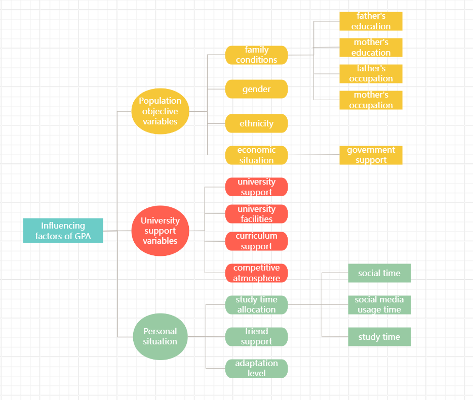

# Take-home Exercise1: Analysis of Factors Influencing the GPA of Students at the University of Education – Vietnam National University

# 1 Overview

## 1.1 Background

This study aims to explore how students’ learning outcomes are influenced by both internal and external factors. These mainly include students’ time allocation for studying, family background, interpersonal relationships, and their satisfaction with the school’s support system (courses, facilities, and teachers).

## 1.2 Six sub questions

-   Analysis of population based on gender, ethnicity, and whether they have received funding, as well as corresponding performance analysis for each population.

    Obejective:To explore whether there are differences in academic performance among different types of students and attempt to provide suggestions for inferring the groups that need attention.

-   Comparing the academic levels of students from different family backgrounds.

    Objective: To explore the impact of parents' educational level and occupation on their children's academic performance.

-   Exploring the impact of student time allocation on academic performance.

    Obejective: To explore the impact of students' social media usage and study time allocation on their academic performance, with a focus on the marginal benefits of study time: whether longer study time necessarily leads to better grades.

-   Visualize students' comprehensive evaluation of school support systems (facilities, courses, teachers).

    Obejective: To more intuitively demonstrate whether there are deficiencies in the current support provided by the school and to find directions for improvement.

-   Find out if the school support system affects students' academic performance (based on students' ratings of various support systems).

    Obejective: To identify support modules that have a greater (and more important) impact on students.

-   Research on the Impact of Competitive Atmosphere on Students.

    Obejective: To verify whether the competitive atmosphere affects academic performance and whether there is a situation where students with excellent grades work harder while those with lower grades are affected.

# 2 reading the data

## 2.1 The data

The dataset was collected from students at the University of Education, Vietnam National University, Hanoi. A total of 2,170 alumni and students completed the questionnaire survey between March and June 2023. The factors affecting GPA are divided into three categories of independent variables. The first category includes objective demographic variables such as gender, ethnicity, parents' education and occupation. The second category includes school support variables, involving the degree of school support, the degree of curriculum support, school facilities, teaching quality, suitability of training courses, and classroom competitive atmosphere. The third category is personal situations: the allocation of personal learning and entertainment, the degree of adaptation to university life, and the influence of friends on learning.

## 2.2 data wrangling

\

## 2.3 data processing

### 2.3.1 Importing data

```{r}
pacman::p_load(ggdist, ggridges, ggthemes,
               colorspace, tidyverse)
```

```{r}
library(readxl)
```

```{r}
exam_data <- read_excel("data/Database paper.xlsx")
```

Check for empty values

```{r}
colSums(is.na(exam_data))
```

```{r}
library(dplyr)
```

Re encode the numerical values 1-5 representing options in the data file into descriptive labels

```{r}
exam_data <- exam_data %>% mutate( 
    Year = factor(Year, 
                  levels = 1:5, 
                  labels = c("First-year", 
                             "Second-year", 
                             "Third-year", 
                             "Fourth-year", 
                             "Graduated")), 
    Gender = factor(Gender, 
                    levels = c(1,2), 
                    labels = c("Male","Female")),
    Policy_Stu = factor(Policy_Stu,
                        levels = c(1,2),
                        labels = c("Yes","No")),
    
    Minority_Stu = factor(Minority_Stu,
                          levels = c(1,2),
                          labels = c("Yes","No")),
    
    Poor_Stu = factor(Poor_Stu,
                      levels = c(1,2),
                      labels = c("Yes","No")),
    
    Father_Edu = factor(Father_Edu,
                        levels = 1:6,
                        labels = c("Primary school",
                                   "Secondary school",
                                   "High school",
                                   "College school",
                                   "University/Graduate",
                                   "Other")),
    
    Mother_Edu = factor(Mother_Edu,
                        levels = 1:6,
                        labels = c("Primary school",
                                   "Secondary school",
                                   "High school",
                                   "College school",
                                   "University/Graduate",
                                   "Other")),
    
    Father_Occupation = factor(Father_Occupation,
                               levels = 1:5,
                               labels = c("Government employee",
                                          "Self-employment",
                                          "Freelance",
                                          "Other",
                                          "Not public")),
    
    Mother_Occupation = factor(Mother_Occupation,
                               levels = 1:5,
                               labels = c("Government employee",
                                          "Self-employment",
                                          "Freelance",
                                          "Other",
                                          "Not public")),
    
    Time_Friends = factor(Time_Friends,
                          levels = 1:5,
                          labels = c("Under 1 hour",
                                     "1–2 hours",
                                     "2–3 hours",
                                     "3–4 hours",
                                     "Over 4 hours")),
    
    Time_SocicalMedia = factor(Time_SocicalMedia,
                               levels = 1:5,
                               labels = c("Under 1 hour",
                                          "1–2 hours",
                                          "2–3 hours",
                                          "3–4 hours",
                                          "Over 4 hours")),
    
    Time_Studying = factor(Time_Studying,
                           levels = 1:5,
                           labels = c("Under 2 hours",
                                      "2–4 hours",
                                      "4–6 hours",
                                      "6–8 hours",
                                      "Over 8 hours")),
    
    GPA = factor(GPA,
                 levels = 1:5,
                 labels = c("Poor (<2.0)",
                            "Average (2.0–2.5)",
                            "Fair (2.5–3.2)",
                            "Good (3.2–3.6)",
                            "Excellent (>3.6)")),
    
    Adapt_Learning_Uni = factor(Adapt_Learning_Uni, levels = 1:5),
    Study_Methods = factor(Study_Methods, levels = 1:5),
    SupportOf_Uni = factor(SupportOf_Uni, levels = 1:5),
    SupportOf_Lec = factor(SupportOf_Lec, levels = 1:5),
    Facilitie_Uni = factor(Facilitie_Uni, levels = 1:5),
    Quality_Lecturer = factor(Quality_Lecturer, levels = 1:5),
    TrainingCurriculum = factor(TrainingCurriculum, levels = 1:5),
    Competitive_Class = factor(Competitive_Class, levels = 1:5),
    InfuenceF_Friends = factor(InfuenceF_Friends, levels = 1:5)
)    
  
```

Check the data processing status and visually display the data

```{r}
exam_data
```

# 3 Data visualization

## 3.1 Analysis of Student Demographic Characteristics

### 3.1.1 Gender distribution

Considering the characteristics of the School of Education, we expect the number of female students to far exceed that of male students. This assumption will be tested statistically. We will also examine whether there are differences in academic performance between male and female students, and explore whether the higher proportion of female enrollment is related to their stronger suitability for this major.

(Table 2) Converting the GPA interval into a fixed value to calculate the average GPA score for male and female students.

(Table 3) A diverging bar chart is created to visualise the GPA distribution by gender based on within-gender proportions.

Firstly, the factor()function is used to manually reorder the GPA categories to ensure a meaningful academic progression from “Poor” to “Excellent”. The count() function in the dplyr package is then used to compute the number of students in each GPA category by gender.

Next, the data are grouped by gender using group_by(), and the proportion within each gender is calculated using mutate(n/sum(n)). This ensures that the percentages for males and females each sum to 100%. To create the mirrored effect, negative values are assigned to male proportions using ifelse(), while female proportions remain positive.

Finally, the ggplot() and geom_col() functions in the ggplot2 package are used to generate the horizontal bar chart. The coord_flip() function rotates the axes, scale_y_continious() formats percentages without negative signs.

(Table 4) To compare GPA distributions by gender, I converted categorical GPA ranges into numeric midpoints and generated a density plot. I used semi-transparent fills for visual overlap and added dashed vertical lines to mark the median for each group. This visualization highlights differences in the shape, spread, and central tendency of academic performance between male and female students.

::: panel-tabset
## Plot

```{r}
#| echo: false
#| warning: false
#| message: false
library(ggplot2)
library(scales)
#table 1
gender_dist <- exam_data %>%
  count(Gender) %>%
  mutate(
    percentage = n / sum(n),
    label = paste0(Gender, "\n",
                   n, " (",
                   percent(percentage, accuracy = 0.1), ")")
  )
p1 <- ggplot(gender_dist, aes(x = "", y = n, fill = Gender)) +
  geom_col(width = 1) +
  coord_polar(theta = "y") +
  geom_text(aes(label = label),
            position = position_stack(vjust = 0.5),
            size = 4) +
  labs(title = "Gender Distribution") +
  scale_fill_manual(values = c("Female" = "#FF9999", "Male" = "#89CFF0")) +
  theme_void() +
  theme(legend.position = "none")
exam_data <- exam_data %>%
  mutate(GPA_num = as.numeric(GPA))

#table 2
avg_gpa <- exam_data %>%
  group_by(Gender) %>%
  summarise(mean_gpa = mean(GPA_num, na.rm = TRUE))
avg_gpa

#table 3
gpa_dist <- exam_data %>%
  count(Gender, GPA) %>%
  mutate(count = ifelse(Gender == "Male", -n, n))
exam_data$GPA <- factor(exam_data$GPA,
                        levels = c("Poor (<2.0)",
                                   "Average (2.0–2.5)",
                                   "Fair (2.5–3.2)",
                                   "Good (3.2–3.6)",
                                   "Excellent (>3.6)"))
gpa_dist <- exam_data %>%
  count(Gender, GPA) %>%
  group_by(Gender) %>%
  mutate(prop = n / sum(n)) %>%
  ungroup() %>%
  mutate(prop = ifelse(Gender == "Male", -prop, prop))
p2 <- ggplot(gpa_dist, aes(x = GPA, y = prop, fill = Gender)) +
  geom_col(width = 0.8) +
  coord_flip() +
  scale_y_continuous(labels = function(x) percent(abs(x), accuracy = 1)) +
  scale_fill_manual(values = c("Male" = "#4C78A8",
                               "Female" = "#E45756")) +
  labs(title = "GPA Distribution by Gender (Within-Gender Proportion)",
       x = "GPA Category",
       y = "Percentage within Gender") +
  theme_minimal()

#table 4
exam_data <- exam_data %>%
  mutate(
    GPA_num = case_when(
      GPA == "Poor (<2.0)"        ~ 1.0,               
      GPA == "Average (2.0–2.5)"  ~ (2.0 + 2.5)/2,     
      GPA == "Fair (2.5–3.2)"     ~ (2.5 + 3.2)/2,     
      GPA == "Good (3.2–3.6)"     ~ (3.2 + 3.6)/2,    
      GPA == "Excellent (>3.6)"   ~ 3.8                 
    )
  )
exam_data <- exam_data %>%
  mutate(Gender = fct_relevel(Gender, "Male", "Female"))
f <- exam_data %>% filter(Gender == "Female")
m <- exam_data %>% filter(Gender == "Male")
p3 <- ggplot(exam_data, aes(x = GPA_num, fill = Gender)) +
  geom_density(alpha = 0.5) +
  geom_vline(aes(xintercept = median(f$GPA_num)), 
             color = "red", linetype = "dashed", linewidth = 1, alpha = 0.5) +
  geom_vline(aes(xintercept = median(m$GPA_num)), 
             color = "blue", linetype = "dashed", linewidth = 1, alpha = 0.5) +
  scale_fill_manual(values = c("Male" = "#4C78A8", "Female" = "#E45756")) +
  labs(title = "GPA Distribution by Gender",
       subtitle = "Density of GPA Scores for Male and Female",
       x = "GPA",
       y = "Density") +
  theme_minimal() +
  theme(plot.title = element_text(hjust = 0.5),
        plot.subtitle = element_text(hjust = 0.5))
library(patchwork)
dashboard <- (p1 | p2) / p3
dashboard
```

## Code

```{r}
#| eval: false
#| warning: false
#| message: false
#table 1
gender_dist <- exam_data %>%
  count(Gender) %>%
  mutate(
    percentage = n / sum(n),
    label = paste0(Gender, "\n",
                   n, " (",
                   percent(percentage, accuracy = 0.1), ")")
  )
ggplot(gender_dist, aes(x = "", y = n, fill = Gender)) +
  geom_col(width = 1) +
  coord_polar(theta = "y") +
  geom_text(aes(label = label),
            position = position_stack(vjust = 0.5),
            size = 4) +
  labs(title = "Gender Distribution") +
  scale_fill_manual(values = c("Female" = "#FF9999", "Male" = "#89CFF0")) +
  theme_void() +
  theme(legend.position = "none")
exam_data <- exam_data %>%
  mutate(GPA_num = as.numeric(GPA))

#table 2
avg_gpa <- exam_data %>%
  group_by(Gender) %>%
  summarise(mean_gpa = mean(GPA_num, na.rm = TRUE))

avg_gpa

#table 3
gpa_dist <- exam_data %>%
  count(Gender, GPA) %>%
  mutate(count = ifelse(Gender == "Male", -n, n))
exam_data$GPA <- factor(exam_data$GPA,
                        levels = c("Poor (<2.0)",
                                   "Average (2.0–2.5)",
                                   "Fair (2.5–3.2)",
                                   "Good (3.2–3.6)",
                                   "Excellent (>3.6)"))
gpa_dist <- exam_data %>%
  count(Gender, GPA) %>%
  group_by(Gender) %>%
  mutate(prop = n / sum(n)) %>%
  ungroup() %>%
  mutate(prop = ifelse(Gender == "Male", -prop, prop))
ggplot(gpa_dist, aes(x = GPA, y = prop, fill = Gender)) +
  geom_col(width = 0.8) +
  coord_flip() +
  scale_y_continuous(labels = function(x) percent(abs(x), accuracy = 1)) +
  scale_fill_manual(values = c("Male" = "#4C78A8",
                               "Female" = "#E45756")) +
  labs(title = "GPA Distribution by Gender (Within-Gender Proportion)",
       x = "GPA Category",
       y = "Percentage within Gender") +
  theme_minimal()

#table 4
exam_data <- exam_data %>%
  mutate(
    GPA_num = case_when(
      GPA == "Poor (<2.0)"        ~ 1.0,               
      GPA == "Average (2.0–2.5)"  ~ (2.0 + 2.5)/2,     
      GPA == "Fair (2.5–3.2)"     ~ (2.5 + 3.2)/2,     
      GPA == "Good (3.2–3.6)"     ~ (3.2 + 3.6)/2,    
      GPA == "Excellent (>3.6)"   ~ 3.8                 
    )
  )
exam_data <- exam_data %>%
  mutate(Gender = fct_relevel(Gender, "Male", "Female"))
f <- exam_data %>% filter(Gender == "Female")
m <- exam_data %>% filter(Gender == "Male")
ggplot(exam_data, aes(x = GPA_num, fill = Gender)) +
  geom_density(alpha = 0.5) +
  geom_vline(aes(xintercept = median(f$GPA_num)), 
             color = "red", linetype = "dashed", linewidth = 1, alpha = 0.5) +
  geom_vline(aes(xintercept = median(m$GPA_num)), 
             color = "blue", linetype = "dashed", linewidth = 1, alpha = 0.5) +
  scale_fill_manual(values = c("Male" = "#4C78A8", "Female" = "#E45756")) +
  labs(title = "GPA Distribution by Gender",
       subtitle = "Density of GPA Scores for Male and Female",
       x = "GPA",
       y = "Density") +
  theme_minimal() +
  theme(plot.title = element_text(hjust = 0.5),
        plot.subtitle = element_text(hjust = 0.5))
```
:::

**Observation**:

(Table 1) This chart shows the number and proportion of male and female students participating in the questionnaire. Although the questionnaire does not represent all students and may differ from the actual situation, it to some extent indicates that there are more female students in the Education College.

(Table 2) The conclusion is that there is not much difference in academic performance between males and females, with slightly higher scores for females. Due to only using the median to replace the GPA interval, there is significant uncertainty. The distribution of each GPA interval is plotted below to further confirm whether females have an advantage in education related studies.

(Table 3) The chart presents the GPA distribution within each gender group. Female students show a higher proportion in the “Fair (2.5–3.2)” and “Good (3.2–3.6)” categories, indicating stronger concentration in the mid-to-upper GPA ranges. In contrast, male students have relatively higher proportions in the lower GPA categories (“Poor” and “Average”). The proportion of students achieving “Excellent (\>3.6)” is small for both genders, with only minor differences observed. The within-gender distribution suggests that female students tend to perform slightly better on average. However, the much smaller male sample size may lead to greater percentage variability, so interpretations should be made cautiously.

(Table 4) Based on the density plot of GPA distribution by gender, the GPA distributions for males and females largely overlap, indicating that students of both genders perform at comparable academic levels. The main concentration for both groups is around a GPA of approximately 2.8–3.0, suggesting this is the most common performance range.

However, female students display slightly higher density at the upper GPA range (above 3.2), implying a greater proportion of high-achieving students compared to males. In contrast, male students show marginally higher density at some lower GPA ranges, indicating slightly more variability in performance. The vertical dashed line (representing the average GPA) appears close to the peak of both distributions, reinforcing the similarity in overall academic outcomes.

In summary, while academic performance in the Education faculty is broadly similar across genders, female students tend to have a modest advantage at higher GPA levels. The higher number of female students in the Education College may be due to the fact that female students are better at studying this major.

### 3.1.2 academic performance of policy supported students and ethnic minority students.

This grouped bar chart visualises the distribution of GPA categories between students who receive support from government (Poor_Stu = "Yes") and those who do not.

First, mutate() and as.numeric() are used to convert GPA into a numerical format for calculating mean values. The factor() function is then applied to manually reorder GPA levels from "Poor" to "Excellent" and define the order of the support status, ensuring a logical progression in the visualization.

Next, the data are processed using dplyr verbs: group_by() and summarise() count the students in each category, while a subsequent mutate() calculates the relative proportion (prop) within each support group. This normalization allows for a fair comparison of performance patterns regardless of the sample size in each group.

Finally, ggplot() and geom_col(position = "dodge") are used to generate the chart. panel-tabset.

::: panel-tabset
## Plot

```{r}
#| echo: false
#| warning: false
#| message: false
#table 1
poor_dist <- exam_data %>%
  count(Poor_Stu) %>%
  mutate(
    percentage = n / sum(n),
    label = paste0(Poor_Stu, "\n",
                   n, " (",
                   percent(percentage, accuracy = 0.1), ")")
  )
p4 <- ggplot(poor_dist, aes(x = "", y = n, fill = Poor_Stu)) +
  geom_col(width = 1) +
  coord_polar(theta = "y") +
  geom_text(aes(label = label),
            position = position_stack(vjust = 0.5),
            size = 4) +
  labs(title = "Supported or not") +
  scale_fill_manual(values = c("Yes" = "#4C78A8", "No" = "#E45756")) +
  theme_void() +
  theme(legend.position = "none")
exam_data <- exam_data %>%
  mutate(GPA_num = as.numeric(GPA))

#table 2
exam_data <- exam_data %>%
  mutate(GPA_num = as.numeric(GPA))
avg_gpa <- exam_data %>%
  group_by(Poor_Stu) %>%
  summarise(mean_gpa = mean(GPA_num, na.rm = TRUE))

avg_gpa

#table 3
exam_data <- exam_data %>%
  mutate(
    GPA = factor(GPA, levels = c(
      "Poor (<2.0)",
      "Average (2.0–2.5)",
      "Fair (2.5–3.2)",
      "Good (3.2–3.6)",
      "Excellent (>3.6)"
    )),
    Poor_Stu = factor(Poor_Stu, levels = c("Yes", "No"))
  )
gpa_prop <- exam_data %>%
  group_by(Poor_Stu, GPA) %>%
  summarise(count = n(), .groups = "drop") %>%
  group_by(Poor_Stu) %>%
  mutate(prop = count / sum(count))
p5 <- ggplot(gpa_prop, aes(x = GPA, y = prop, fill = Poor_Stu)) +
  geom_col(position = "dodge") +
  scale_y_continuous(labels = percent_format(accuracy = 1)) +
  scale_fill_manual(values = c("Yes" = "#4C78A8", "No" = "#E45756")) +
  labs(
    title = "GPA Distribution by Students Supported or Not",
    x = "GPA Category",
    y = "Proportion within Group",
    fill = "Supported"
  ) +
  theme_minimal() +
  theme(
    plot.title = element_text(hjust = 0.5),
    axis.title.y = element_text(angle = 0, vjust = 0.5, hjust = 1),
    axis.text.x = element_text(angle = 45, vjust = 1, hjust = 1)
  )
dashboard <- (p4 | p5) 
dashboard
```

## Code

```{r}
#| eval: false
#| warning: false
#| message: false
#table 1
poor_dist <- exam_data %>%
  count(Poor_Stu) %>%
  mutate(
    percentage = n / sum(n),
    label = paste0(Poor_Stu, "\n",
                   n, " (",
                   percent(percentage, accuracy = 0.1), ")")
  )
ggplot(poor_dist, aes(x = "", y = n, fill = Poor_Stu)) +
  geom_col(width = 1) +
  coord_polar(theta = "y") +
  geom_text(aes(label = label),
            position = position_stack(vjust = 0.5),
            size = 4) +
  labs(title = "Supported or not") +
  scale_fill_manual(values = c("Yes" = "#4C78A8", "No" = "#E45756")) +
  theme_void() +
  theme(legend.position = "none")
exam_data <- exam_data %>%
  mutate(GPA_num = as.numeric(GPA))

#table 2
exam_data <- exam_data %>%
  mutate(GPA_num = as.numeric(GPA))
avg_gpa <- exam_data %>%
  group_by(Poor_Stu) %>%
  summarise(mean_gpa = mean(GPA_num, na.rm = TRUE))

avg_gpa

#table 3
exam_data <- exam_data %>%
  mutate(
    GPA = factor(GPA, levels = c(
      "Poor (<2.0)",
      "Average (2.0–2.5)",
      "Fair (2.5–3.2)",
      "Good (3.2–3.6)",
      "Excellent (>3.6)"
    )),
    Poor_Stu = factor(Poor_Stu, levels = c("Yes", "No"))
  )
gpa_prop <- exam_data %>%
  group_by(Poor_Stu, GPA) %>%
  summarise(count = n(), .groups = "drop") %>%
  group_by(Poor_Stu) %>%
  mutate(prop = count / sum(count))
ggplot(gpa_prop, aes(x = GPA, y = prop, fill = Poor_Stu)) +
  geom_col(position = "dodge") +
  scale_y_continuous(labels = percent_format(accuracy = 1)) +
  scale_fill_manual(values = c("Yes" = "#4C78A8", "No" = "#E45756")) +
  labs(
    title = "GPA Distribution by Students Supported or Not",
    x = "GPA Category",
    y = "Proportion within Group",
    fill = "Supported"
  ) +
  theme_minimal() +
  theme(
    plot.title = element_text(hjust = 0.5),
    axis.title.y = element_text(angle = 0, vjust = 0.5, hjust = 1),
    axis.text.x = element_text(angle = 45, vjust = 1, hjust = 1)
  )
```
:::

**Observation**: Although the average GPA of supported students is lower, from the distribution of grades, they are more concentrated in the average GPA, with fewer high scoring students and no particularly obvious disadvantage. Therefore, the variable of supported students will not be removed in subsequent GPA research.

::: panel-tabset
## Plot

```{r}
#| echo: false
#| warning: false
#| message: false
#table 1
Minority_dist <- exam_data %>%
  count(Minority_Stu) %>%
  mutate(
    percentage = n / sum(n),
    label = paste0(Minority_Stu, "\n",
                   n, " (",
                   percent(percentage, accuracy = 0.1), ")")
  )
p6 <- ggplot(Minority_dist, aes(x = "", y = n, fill = Minority_Stu)) +
  geom_col(width = 1) +
  coord_polar(theta = "y") +
  geom_text(aes(label = label),
            position = position_stack(vjust = 0.5),
            size = 4) +
  labs(title = "Minority or not") +
  scale_fill_manual(values = c("Yes" = "#4C78A8", "No" = "#E45756")) +
  theme_void() +
  theme(legend.position = "none")
exam_data <- exam_data %>%
  mutate(GPA_num = as.numeric(GPA))

#table 2
exam_data <- exam_data %>%
  mutate(GPA_num = as.numeric(GPA))
avg_gpa <- exam_data %>%
  group_by(Minority_Stu) %>%
  summarise(mean_gpa = mean(GPA_num, na.rm = TRUE))

avg_gpa

#table 3
exam_data <- exam_data %>%
  mutate(
    GPA = factor(GPA, levels = c(
      "Poor (<2.0)",
      "Average (2.0–2.5)",
      "Fair (2.5–3.2)",
      "Good (3.2–3.6)",
      "Excellent (>3.6)"
    )),
    Minority_Stu = factor(Minority_Stu, levels = c("Yes", "No"))
  )
gpa_prop <- exam_data %>%
  group_by(Minority_Stu, GPA) %>%
  summarise(count = n(), .groups = "drop") %>%
  group_by(Minority_Stu) %>%
  mutate(prop = count / sum(count))
p7 <- ggplot(gpa_prop, aes(x = GPA, y = prop, fill = Minority_Stu)) +
  geom_col(position = "dodge") +
  scale_y_continuous(labels = percent_format(accuracy = 1)) +
  scale_fill_manual(values = c("Yes" = "#4C78A8", "No" = "#E45756")) +
  labs(
    title = "GPA distribution of students from different ethnic groups",
    x = "GPA Category",
    y = "Proportion within Group",
    fill = "Minority"
  ) +
  theme_minimal() +
  theme(
    plot.title = element_text(hjust = 0.5),
    axis.title.y = element_text(angle = 0, vjust = 0.5, hjust = 1),
    axis.text.x = element_text(angle = 45, vjust = 1, hjust = 1)
  )
dashboard <- (p6 | p7) 
dashboard
```

## Code

```{r}
#| eval: false
#| warning: false
#| message: false
#table 1
Minority_dist <- exam_data %>%
  count(Minority_Stu) %>%
  mutate(
    percentage = n / sum(n),
    label = paste0(Minority_Stu, "\n",
                   n, " (",
                   percent(percentage, accuracy = 0.1), ")")
  )
ggplot(Minority_dist, aes(x = "", y = n, fill = Minority_Stu)) +
  geom_col(width = 1) +
  coord_polar(theta = "y") +
  geom_text(aes(label = label),
            position = position_stack(vjust = 0.5),
            size = 4) +
  labs(title = "Minority or not") +
  scale_fill_manual(values = c("Yes" = "#4C78A8", "No" = "#E45756")) +
  theme_void() +
  theme(legend.position = "none")
exam_data <- exam_data %>%
  mutate(GPA_num = as.numeric(GPA))

#table 2
exam_data <- exam_data %>%
  mutate(GPA_num = as.numeric(GPA))
avg_gpa <- exam_data %>%
  group_by(Minority_Stu) %>%
  summarise(mean_gpa = mean(GPA_num, na.rm = TRUE))

avg_gpa

#table 3
exam_data <- exam_data %>%
  mutate(
    GPA = factor(GPA, levels = c(
      "Poor (<2.0)",
      "Average (2.0–2.5)",
      "Fair (2.5–3.2)",
      "Good (3.2–3.6)",
      "Excellent (>3.6)"
    )),
    Minority_Stu = factor(Minority_Stu, levels = c("Yes", "No"))
  )
gpa_prop <- exam_data %>%
  group_by(Minority_Stu, GPA) %>%
  summarise(count = n(), .groups = "drop") %>%
  group_by(Minority_Stu) %>%
  mutate(prop = count / sum(count))
ggplot(gpa_prop, aes(x = GPA, y = prop, fill = Minority_Stu)) +
  geom_col(position = "dodge") +
  scale_y_continuous(labels = percent_format(accuracy = 1)) +
  scale_fill_manual(values = c("Yes" = "#4C78A8", "No" = "#E45756")) +
  labs(
    title = "GPA distribution of students from different ethnic groups",
    x = "GPA Category",
    y = "Proportion within Group",
    fill = "Minority"
  ) +
  theme_minimal() +
  theme(
    plot.title = element_text(hjust = 0.5),
    axis.title.y = element_text(angle = 0, vjust = 0.5, hjust = 1),
    axis.text.x = element_text(angle = 45, vjust = 1, hjust = 1)
  )
```
:::

**Observation**: The average GPA of ethnic minority students is very similar to that of other students, but the vast majority of ethnic minority students are concentrated in intermediate grades, with few high and low GPA students. However, due to the very small number of ethnic minority students, the overall impact is not significant, and all subsequent studies will not exclude ethnic variables.

## 3.2 The influence of family background on academic performance

### 3.2.1 The influence of parents' education level on their children's GPA

This analysis utilizes a heatmap and an alluvial diagram to examine the relationship between parental education levels and student GPA.

First, the filter() function is used to exclude "Other" categories, ensuring the analysis focuses on defined educational backgrounds. For the heatmap, group_by() and summarise() aggregate the data to calculate the mean GPA for every combination of maternal and paternal education. For the alluvial diagram, count() identifies the frequency of students across the flow of parental education to final GPA categories.

Next, ggplot2 and its extension ggalluvial are employed for visualization. The geom_tile() function generates a heatmap to highlight the interaction effect of parental education on average performance. Simultaneously, geom_alluvium() and geom_stratum() create a flow visualization that tracks how student cohorts transition from their socioeconomic background to specific academic outcomes.

::: panel-tabset
## Plot

```{r}
#| echo: false
#| warning: false
#| message: false
library(tidyverse)

#table 1
edu_gpa <- exam_data %>%
  filter(Father_Edu != "Other") %>%
  filter(Mother_Edu != "Other") %>%
  group_by(Father_Edu, Mother_Edu) %>%
  summarise(mean_gpa = mean(GPA_num, na.rm = TRUE), .groups = "drop")

ggplot(edu_gpa, aes(x = Father_Edu, y = Mother_Edu, fill = mean_gpa)) +
  geom_tile(color = "white", size = 0.5) +
  scale_fill_gradientn(colors = c("#f7fbff", "#6baed6", "#08306b")) +
  labs(title = "Average GPA by Parental Education Interaction",
       x = "Father's Education", y = "Mother's Education",
       fill = "Mean GPA") +
  theme_minimal() +
  theme(axis.text.x = element_text(angle = 45, vjust = 1, hjust = 1))

#table 2
library(ggalluvial)
plot_data <- exam_data %>%
  filter(Father_Edu != "Other", Mother_Edu != "Other") %>%
  count(Father_Edu, Mother_Edu, GPA) 
ggplot(plot_data,
       aes(y = n, 
           axis1 = Father_Edu, 
           axis2 = Mother_Edu, 
           axis3 = GPA)) + 
  geom_alluvium(aes(fill = GPA), width = 1/12) + 
  geom_stratum(width = 1/12, fill = "white", color = "grey") +
  geom_text(stat = "stratum", aes(label = after_stat(stratum)), size = 3) +
  scale_x_discrete(limits = c("Father Edu", "Mother Edu", "Student GPA"), 
                   expand = c(.05, .05)) +
  scale_fill_brewer(palette = "RdYlBu", direction = -1) + 
  theme_minimal() +
  labs(title = "Impact of Parental Education on GPA Tiers",
       y = "Number of Students",
       fill = "GPA Category") +
  theme(legend.position = "bottom")
```

## Code

```{r}
#| eval: false
#| warning: false
#| message: false
#table 1
edu_gpa <- exam_data %>%
  filter(Father_Edu != "Other") %>%
  filter(Mother_Edu != "Other") %>%
  group_by(Father_Edu, Mother_Edu) %>%
  summarise(mean_gpa = mean(GPA_num, na.rm = TRUE), .groups = "drop")

ggplot(edu_gpa, aes(x = Father_Edu, y = Mother_Edu, fill = mean_gpa)) +
  geom_tile(color = "white", size = 0.5) +
  scale_fill_gradientn(colors = c("#f7fbff", "#6baed6", "#08306b")) +
  labs(title = "Average GPA by Parental Education Interaction",
       x = "Father's Education", y = "Mother's Education",
       fill = "Mean GPA") +
  theme_minimal() +
  theme(axis.text.x = element_text(angle = 45, vjust = 1, hjust = 1))

#table 2
library(ggalluvial)
plot_data <- exam_data %>%
  filter(Father_Edu != "Other", Mother_Edu != "Other") %>%
  count(Father_Edu, Mother_Edu, GPA) 
ggplot(plot_data,
       aes(y = n, 
           axis1 = Father_Edu, 
           axis2 = Mother_Edu, 
           axis3 = GPA)) + 
  geom_alluvium(aes(fill = GPA), width = 1/12) + 
  geom_stratum(width = 1/12, fill = "white", color = "grey") +
  geom_text(stat = "stratum", aes(label = after_stat(stratum)), size = 3) +
  scale_x_discrete(limits = c("Father Edu", "Mother Edu", "Student GPA"), 
                   expand = c(.05, .05)) +
  scale_fill_brewer(palette = "RdYlBu", direction = -1) + 
  theme_minimal() +
  labs(title = "Impact of Parental Education on GPA Tiers",
       y = "Number of Students",
       fill = "GPA Category") +
  theme(legend.position = "bottom")
```
:::

**Observation**:

(Table 1) From the heatmap, it can be observed that the educational level of parents and the GPA of their children are basically proportional, and the impact of the mother's university degree on the child's grades is most intuitive. In cases where the mother's education level is extremely high, the father's education level has almost no effect, and the child's GPA is generally excellent. This may be due to the fact that in today's society, family education is generally led by the mother.

(Table 2) The Parallel Categories Diagram provides a more intuitive display of the impact of parental education on children's academic performance. It can be seen that the vast majority of outstanding students come from families where their parents have higher education than high schools, and students with good grades also have a higher proportion of parents with higher education levels, fully demonstrating the importance of shogunate education.

### 3.2.2 The influence of parents' occupation on their children's GPA

This analysis examines the impact of parental occupation on student GPA using a faceted boxplot visualization.

Initially, the filter() function is applied to remove "Other" occupational categories to maintain research focus. The Father_Occupation and Mother_Occupation variables are treated as nominal factors, while GPA is analyzed in its numeric form (GPA_num) to capture granular variations.

Using ggplot2, the data is partitioned by father’s occupation via facet_wrap(), allowing for a simultaneous comparison of mother’s occupation across different household contexts. The inclusion of stat_summary() provides a clear indication of mean performance, while the boxplot components reveal the interquartile range and skewness within each occupational subgroup. This visualization effectively identifies which parental career combinations correlate with higher academic achievement.

::: panel-tabset
## Plot

```{r}
#| echo: false
#| warning: false
#| message: false
occ_data <- exam_data %>%
  filter(Father_Occupation != "Other", Mother_Occupation != "Other")

ggplot(occ_data, aes(x = Mother_Occupation, y = GPA_num, fill = Mother_Occupation)) +
  geom_boxplot(alpha = 0.7, outlier.alpha = 0.5) +
  stat_summary(fun = mean, geom = "point", shape = 23, size = 2, fill = "white") +
  facet_wrap(~Father_Occupation, labeller = label_both) +
  scale_fill_brewer(palette = "Pastel1") + 
  labs(
    title = "Student GPA Distribution by Parental Occupations",
    subtitle = "White diamonds represent the mean GPA",
    x = "Mother's Occupation",
    y = "Numeric GPA"
  ) +
  theme_minimal() +
  theme(
    axis.text.x = element_text(angle = 45, vjust = 1, hjust = 1),
    legend.position = "none", 
    strip.background = element_rect(fill = "grey95"), 
    strip.text = element_text(face = "bold")
  )
```

## Code

```{r}
#| eval: false
#| warning: false
#| message: false
occ_data <- exam_data %>%
  filter(Father_Occupation != "Other", Mother_Occupation != "Other")

ggplot(occ_data, aes(x = Mother_Occupation, y = GPA_num, fill = Mother_Occupation)) +
  geom_boxplot(alpha = 0.7, outlier.alpha = 0.5) +
  stat_summary(fun = mean, geom = "point", shape = 23, size = 2, fill = "white") +
  facet_wrap(~Father_Occupation, labeller = label_both) +
  scale_fill_brewer(palette = "Pastel1") + 
  labs(
    title = "Student GPA Distribution by Parental Occupations",
    subtitle = "White diamonds represent the mean GPA",
    x = "Mother's Occupation",
    y = "Numeric GPA"
  ) +
  theme_minimal() +
  theme(
    axis.text.x = element_text(angle = 45, vjust = 1, hjust = 1),
    legend.position = "none", 
    strip.background = element_rect(fill = "grey95"), 
    strip.text = element_text(face = "bold")
  )
```
:::

**Observation**: The faceted boxplot reveals that students with at least one parent in government employment or self-employment tend to achieve higher and more stable GPAs. This may reflect the family environment or educational resource advantages brought by the professional background. In contrast, families where the father's occupation is categorized as 'Not public' show greater variability and generally lower median performance, suggesting that parental career stability may correlate with academic consistency.

## 3.3 The impact of time allocation on GPA (study time, social time, social media time)

This section examines the correlation between academic performance and daily time allocation across three dimensions: studying, social interaction, and social media usage.

Data were reorganized using the pivot_longer() function from the tidyverse to facilitate a comparative analysis. The variables—Time_Friends, Time_SocicalMedia, and Time_Studying—were maintained as ordinal factors to preserve the logical increment of time intervals.

Two visualization strategies were employed: faceted line charts to identify individual trends and a heat map to explore the interaction between productive (study) and distributive (social media) time. By calculating the mean_gpa for each category, the visualization reveals potential "tipping points" where excessive social or media time begins to negatively correlate with academic outcomes.

::: panel-tabset
## Plot

```{r}
#| echo: false
#| warning: false
#| message: false

#table 1
time_impact <- exam_data %>%
  select(GPA_num, Time_Friends, Time_SocicalMedia, Time_Studying) %>%
  pivot_longer(cols = starts_with("Time"), 
               names_to = "Activity_Type", 
               values_to = "Time_Spent") %>%
  group_by(Activity_Type, Time_Spent) %>%
  summarise(mean_gpa = mean(GPA_num, na.rm = TRUE), .groups = "drop")
p10 <- ggplot(time_impact, aes(x = Time_Spent, y = mean_gpa, group = Activity_Type, color = Activity_Type)) +
  geom_line(size = 1.2) +
  geom_point(size = 3) +
  facet_wrap(~Activity_Type, scales = "free_x") +
  scale_color_brewer(palette = "Set1") +
  labs(
    title = "Impact of Time Allocation on Average GPA",
    x = "Hours Spent",
    y = "Average GPA",
    subtitle = "Comparing Study, Social, and Social Media Time"
  ) +
  theme_minimal() +
  theme(axis.text.x = element_text(angle = 45, vjust = 1, hjust = 1),
        legend.position = "none")

#table 2
interaction_data <- exam_data %>%
  group_by(Time_Studying, Time_SocicalMedia) %>%
  summarise(mean_gpa = mean(GPA_num, na.rm = TRUE), .groups = "drop")

p11 <- ggplot(interaction_data, aes(x = Time_Studying, y = Time_SocicalMedia, fill = mean_gpa)) +
  geom_tile(color = "white") +
  scale_fill_distiller(palette = "RdYlGn", direction = 1) + 
  labs(
    title = "Interaction of Study and Social Media Time on GPA",
    x = "Study Time",
    y = "Social Media Time",
    fill = "Mean GPA"
  ) +
  theme_minimal() +
  theme(axis.text.x = element_text(angle = 45, vjust = 1, hjust = 1))
dashboard <- p10 / p11
dashboard
```

## Code

```{r}
#| eval: false
#| warning: false
#| message: false
#table 1
time_impact <- exam_data %>%
  select(GPA_num, Time_Friends, Time_SocicalMedia, Time_Studying) %>%
  pivot_longer(cols = starts_with("Time"), 
               names_to = "Activity_Type", 
               values_to = "Time_Spent") %>%
  group_by(Activity_Type, Time_Spent) %>%
  summarise(mean_gpa = mean(GPA_num, na.rm = TRUE), .groups = "drop")
ggplot(time_impact, aes(x = Time_Spent, y = mean_gpa, group = Activity_Type, color = Activity_Type)) +
  geom_line(size = 1.2) +
  geom_point(size = 3) +
  facet_wrap(~Activity_Type, scales = "free_x") +
  scale_color_brewer(palette = "Set1") +
  labs(
    title = "Impact of Time Allocation on Average GPA",
    x = "Hours Spent",
    y = "Average GPA",
    subtitle = "Comparing Study, Social, and Social Media Time"
  ) +
  theme_minimal() +
  theme(axis.text.x = element_text(angle = 45, vjust = 1, hjust = 1),
        legend.position = "none")

#table 2
interaction_data <- exam_data %>%
  group_by(Time_Studying, Time_SocicalMedia) %>%
  summarise(mean_gpa = mean(GPA_num, na.rm = TRUE), .groups = "drop")

ggplot(interaction_data, aes(x = Time_Studying, y = Time_SocicalMedia, fill = mean_gpa)) +
  geom_tile(color = "white") +
  scale_fill_distiller(palette = "RdYlGn", direction = 1) + 
  labs(
    title = "Interaction of Study and Social Media Time on GPA",
    x = "Study Time",
    y = "Social Media Time",
    fill = "Mean GPA"
  ) +
  theme_minimal() +
  theme(axis.text.x = element_text(angle = 45, vjust = 1, hjust = 1))
```
:::

Observation:

(Table 1) There is a negative correlation between social and media usage time and GPA. After socializing for more than 2 hours a day, GPA begins to show a significant stepwise decline. However, after playing social media for more than 3 hours a day, GPA shows a more severe cliff like decline. Learning time is positively correlated with GPA, but it is not a simple linear relationship. Students who study for less than 2 hours perform well, but show a clear dip in the 2-4 hour range, which may be due to poor learning efficiency and not spending more time and effort. Subsequently, with the increase of time (more than 4 hours), there is a strong positive correlation growth, reaching the highest score after 8 hours.

(Table 2) The heatmap further illustrates the game between learning time and play time. Overall, as learning time increases and social media usage time decreases, grades will gradually improve. However, there is a clear red block (GPA\<1.5) in the graph, located in the combination of 4-6 hours of study but\<1 hour of social media, which may indicate that the time has been spent elsewhere.

## 3.4 Comprehensive evaluation of university support system by students

A diverging stacked bar chart is created to visualise the distribution of students’ satisfaction ratings across five university support dimensions.

Firstly, the `mutate()` function in the dplyr package is used to convert the Likert-scale numeric responses (1–5) into ordered factor variables with meaningful labels. The `pivot_longer()` function in the tidyr package then transforms the dataset from wide to long format so that all items can be analysed together. The data are grouped by item and response category using `group_by()`, and the number of responses is calculated using `summarise()`. The percentage distribution within each item is then computed.

To create a diverging effect, negative values are assigned to the lower satisfaction levels, while neutral and positive responses remain positive. Finally, the `ggplot()` and `geom_bar()` functions in the ggplot2 package are used to generate the horizontal stacked bar chart, with aesthetic adjustments made using `coord_flip()`, `scale_y_continuous()`, `labs()`, and `theme()`.

::: panel-tabset
## Plot

```{r}
#| echo: false
#| warning: false
#| message: false
library(dplyr)
library(tidyr)
likert_cols <- c("SupportOf_Uni", "SupportOf_Lec", 
                 "Facilitie_Uni", "Quality_Lecturer", "TrainingCurriculum")
exam_data <- exam_data %>%
  mutate(across(all_of(likert_cols),
                ~ factor(.,
                         levels = 1:5,
                         labels = c("Not at all","Little","Moderate","Quite","Very"))))
long_data <- exam_data %>%
  mutate(ID = row_number()) %>% 
  pivot_longer(cols = all_of(likert_cols), names_to = "Item", values_to = "Response") %>%
  group_by(Item, Response) %>%
  summarise(n = n(), .groups = "drop") %>%
  complete(Item, Response = c("Not at all","Little","Moderate","Quite","Very"),
           fill = list(n = 0)) %>%
  group_by(Item) %>%
  mutate(prop = n / sum(n) * 100) %>%
  ungroup() %>%
  mutate(
    prop = case_when(
      Response %in% c("Not at all","Little") ~ -prop,
      TRUE ~ prop
    ),
    Response = factor(Response, levels = c("Not at all","Little","Moderate","Quite","Very"))
  )
ggplot(long_data, aes(x = Item, y = prop, fill = Response)) +
  geom_bar(stat = "identity", width = 0.7) +
  coord_flip() +
  scale_y_continuous(labels = function(x) paste0(abs(x), "%")) +
  scale_fill_brewer(palette = "RdYlBu", direction = -1) +
  labs(title = "University & Lecture Support Survey",
       subtitle = "Distribution of Satisfaction Ratings",
       x = NULL,
       y = "Percentage") +
  theme_minimal() +
  theme(plot.title = element_text(hjust = 0.5, size=14, face="bold"),
        plot.subtitle = element_text(hjust = 0.5, size=12),
        axis.text = element_text(size=11),
        legend.title = element_blank())

```

## Code

```{r}
#| eval: false
#| warning: false
#| message: false
likert_cols <- c("SupportOf_Uni", "SupportOf_Lec", 
                 "Facilitie_Uni", "Quality_Lecturer", "TrainingCurriculum")
exam_data <- exam_data %>%
  mutate(across(all_of(likert_cols),
                ~ factor(.,
                         levels = 1:5,
                         labels = c("Not at all","Little","Moderate","Quite","Very"))))
long_data <- exam_data %>%
  mutate(ID = row_number()) %>% 
  pivot_longer(cols = all_of(likert_cols), names_to = "Item", values_to = "Response") %>%
  group_by(Item, Response) %>%
  summarise(n = n(), .groups = "drop") %>%
  complete(Item, Response = c("Not at all","Little","Moderate","Quite","Very"),
           fill = list(n = 0)) %>%
  group_by(Item) %>%
  mutate(prop = n / sum(n) * 100) %>%
  ungroup() %>%
  mutate(
    prop = case_when(
      Response %in% c("Not at all","Little") ~ -prop,
      TRUE ~ prop
    ),
    Response = factor(Response, levels = c("Not at all","Little","Moderate","Quite","Very"))
  )
ggplot(long_data, aes(x = Item, y = prop, fill = Response)) +
  geom_bar(stat = "identity", width = 0.7) +
  coord_flip() +
  scale_y_continuous(labels = function(x) paste0(abs(x), "%")) +
  scale_fill_brewer(palette = "RdYlBu", direction = -1) +
  labs(title = "University & Lecture Support Survey",
       subtitle = "Distribution of Satisfaction Ratings",
       x = NULL,
       y = "Percentage") +
  theme_minimal() +
  theme(plot.title = element_text(hjust = 0.5, size=14, face="bold"),
        plot.subtitle = element_text(hjust = 0.5, size=12),
        axis.text = element_text(size=11),
        legend.title = element_blank())

```
:::

**Observation**: We can see from this picture that the majority of responses fall into “Very” and “Quite”, which together account for more than half of the ratings. This indicates that students are generally satisfied with the school and teaching support, with the highest proportion of high scores in course quality. This suggests that students are most satisfied with lecturer quality. The performance of course support and university curriculum is also good, but there is a significant difference in the evaluation of school facilities, with fewer high scores supported by the school, which may lead to some unsatisfactory issues.

## 3.5 Further analyze the impact of students' satisfaction with the school support system on their GPA

Creating a ridge plot to examine the relationship between students' overall satisfaction index and academic performance (GPA).

Firstly, by using mutate() and across() to convert the five dimensions of the Likert scale back to numerical values, a comprehensive support index is constructed. The rowMeans() function is used to calculate the overall satisfaction score for each student. To ensure comparability between different GPA levels, the index was standardized using the scale() function.

Next, process the data to align with the sequential GPA categories. The ggplot() function, along with the ggridges and ggdist packages, is used to map support indices to the x-axis and GPA categories to the y-axis. Specifically, geom_density_ridges (or stat_calfeie()) is used to visualize density distribution, allowing for the identification of changes in satisfaction peaks at different performance levels.

::: panel-tabset
## Plot

```{r}
#| echo: false
#| warning: false
#| message: false
exam_data <- exam_data %>%
  mutate(
    across(all_of(likert_cols), as.numeric, .names = "{col}_num"),
    Support_Index = rowMeans(select(., ends_with("_num")), na.rm = TRUE),
    Support_Index_Std = scale(Support_Index)
  )
library(ggridges)
ggplot(exam_data, aes(x = Support_Index, y = GPA, fill = GPA)) +
  geom_density_ridges(alpha = 0.7, scale = 1.2, color = "white") +
  scale_fill_brewer(palette = "RdYlBu", direction = -1) +
  labs(
    title = "Ridgeline View of Support Index Across GPA Levels",
    subtitle = "Distribution shifts across ordinal GPA categories",
    x = "Support Satisfaction Index (1-5)",
    y = "GPA Category"
  ) +
  theme_minimal() +
  theme(
    legend.position = "none",
    plot.title = element_text(hjust = 0.5, face = "bold"),
    plot.subtitle = element_text(hjust = 0.5)
  )
```

## Code

```{r}
#| eval: false
#| warning: false
#| message: false
exam_data <- exam_data %>%
  mutate(
    across(all_of(likert_cols), as.numeric, .names = "{col}_num"),
    Support_Index = rowMeans(select(., ends_with("_num")), na.rm = TRUE),
    Support_Index_Std = scale(Support_Index)
  )
library(ggridges)
ggplot(exam_data, aes(x = Support_Index, y = GPA, fill = GPA)) +
  geom_density_ridges(alpha = 0.7, scale = 1.2, color = "white") +
  scale_fill_brewer(palette = "RdYlBu", direction = -1) +
  labs(
    title = "Ridgeline View of Support Index Across GPA Levels",
    subtitle = "Distribution shifts across ordinal GPA categories",
    x = "Support Satisfaction Index (1-5)",
    y = "GPA Category"
  ) +
  theme_minimal() +
  theme(
    legend.position = "none",
    plot.title = element_text(hjust = 0.5, face = "bold"),
    plot.subtitle = element_text(hjust = 0.5)
  )
```
:::

**Observation**: As the GPA increases from 'Poor' to 'Excellent', the peak (mode) of the satisfaction index curve shifts significantly to the right. This indicates that students with better academic performance typically have higher evaluations of the school's support, such as teaching quality and curriculum design. The curve of the "Excellent" group is the steepest and most concentrated, indicating that high scoring students have very consistent evaluations of satisfaction. The curve of the "Poor" group is smoother and shows multiple peaks, indicating that students with poor grades have serious differentiation in their perception of satisfaction.

## 3.6 The differential impact of competitive atmosphere on individuals with different levels of academic performance (GPA)

In order to explore the relationship between students' GPA scores and class competition. I use heat maps to visualize the distribution levels of GPA across different competitive classes. Use geom_tile() to create a heatmap, where the x-axis represents competition level and the y-axis represents GPA category. The fill color corresponds to the proportion of students in each GPA category of the given class type. Gradient shades (from white to steel blue) have been applied, so darker tones represent higher proportions.

::: panel-tabset
## Plot

```{r}
#| echo: false
#| warning: false
#| message: false
gpa_table <- exam_data %>%
  count(Competitive_Class, GPA) %>%
  group_by(Competitive_Class) %>%
  mutate(prop = n / sum(n))

ggplot(gpa_table, aes(x = factor(Competitive_Class), y = GPA, fill = prop)) +
  geom_tile() +
  scale_fill_gradient(low = "white", high = "steelblue") +
  labs(x = "Competitive Class Affect", y = "GPA Category", fill = "Proportion") +
  theme_minimal()
```

## Code

```{r}
#| eval: false
#| warning: false
#| message: false
gpa_table <- exam_data %>%
  count(Competitive_Class, GPA) %>%
  group_by(Competitive_Class) %>%
  mutate(prop = n / sum(n))

ggplot(gpa_table, aes(x = factor(Competitive_Class), y = GPA, fill = prop)) +
  geom_tile() +
  scale_fill_gradient(low = "white", high = "steelblue") +
  labs(x = "Competitive Class Affect", y = "GPA Category", fill = "Proportion") +
  theme_minimal()
```
:::

**Observation**: Overall, students with better grades believe that class competition has a stronger impact. Students with a GPA higher than 3.2 in the chart choose more high impact individuals (from shallow to deep in the proportion), while students with a GPA lower than 3.2 generally show a trend from deep to shallow. This may be due to their less prominent ranking, as they do not care as much about competition. Competition does have a motivating effect on learning, but it is only more effective for students with good grades.

# 4 Summary and Conclusion

The goal of this research is to provide a holistic understanding of the drivers behind student GPA variations. By integrating individual demographics, household characteristics, and school-level support indicators, the study aims to provide data-driven insights for university administrators to develop targeted intervention strategies, particularly for students facing socioeconomic challenges or dissatisfaction with campus resources.

# 5 References

-   R for Visual Analytics. https://r4va.netlify.app/

-   Introduction to ggridges. https://cran.r-project.org/web/packages/ggridges/vignettes/introduction.html

-   Ggalluvial https://corybrunson.github.io/ggalluvial/
