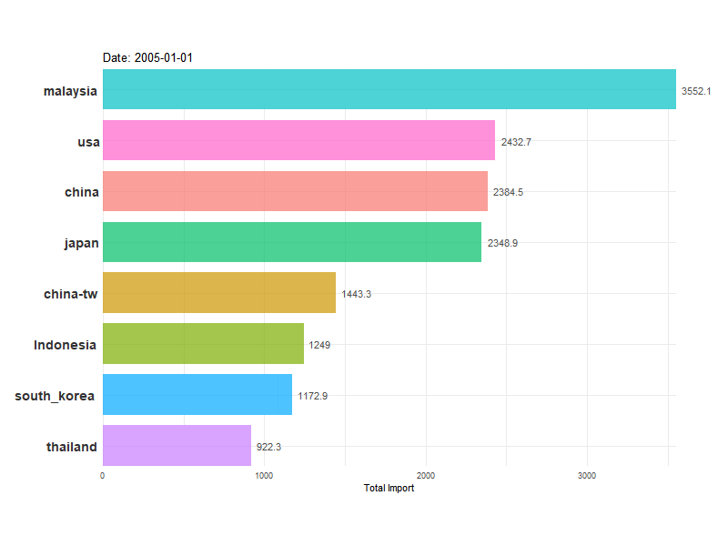
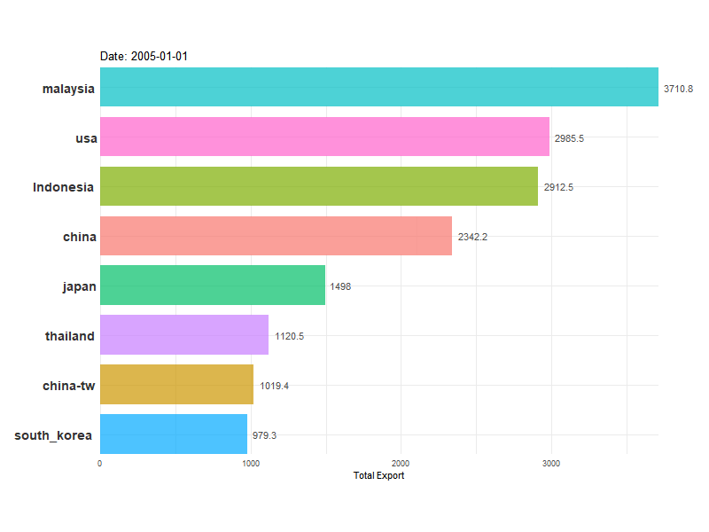
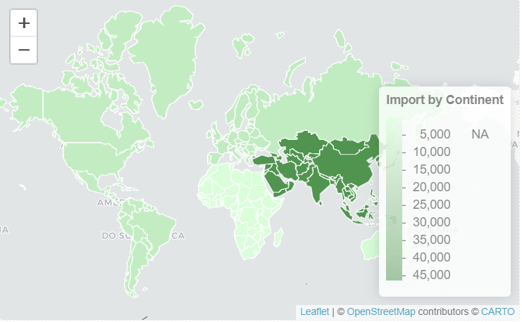
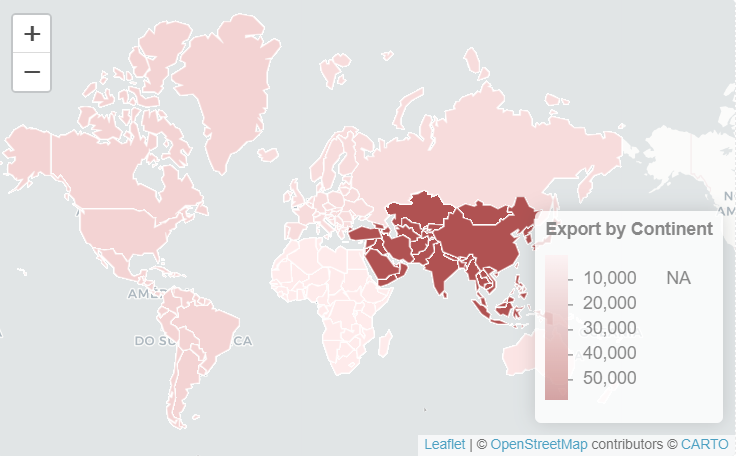
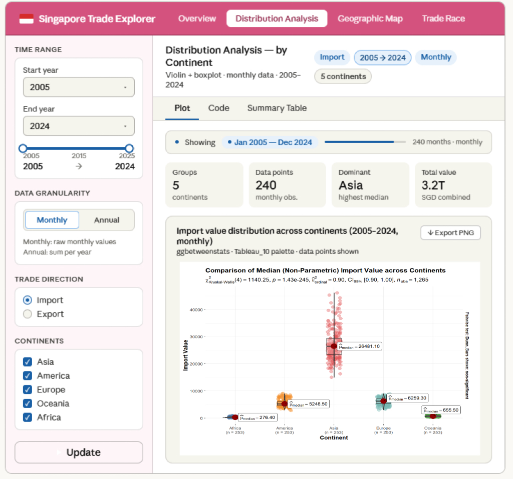
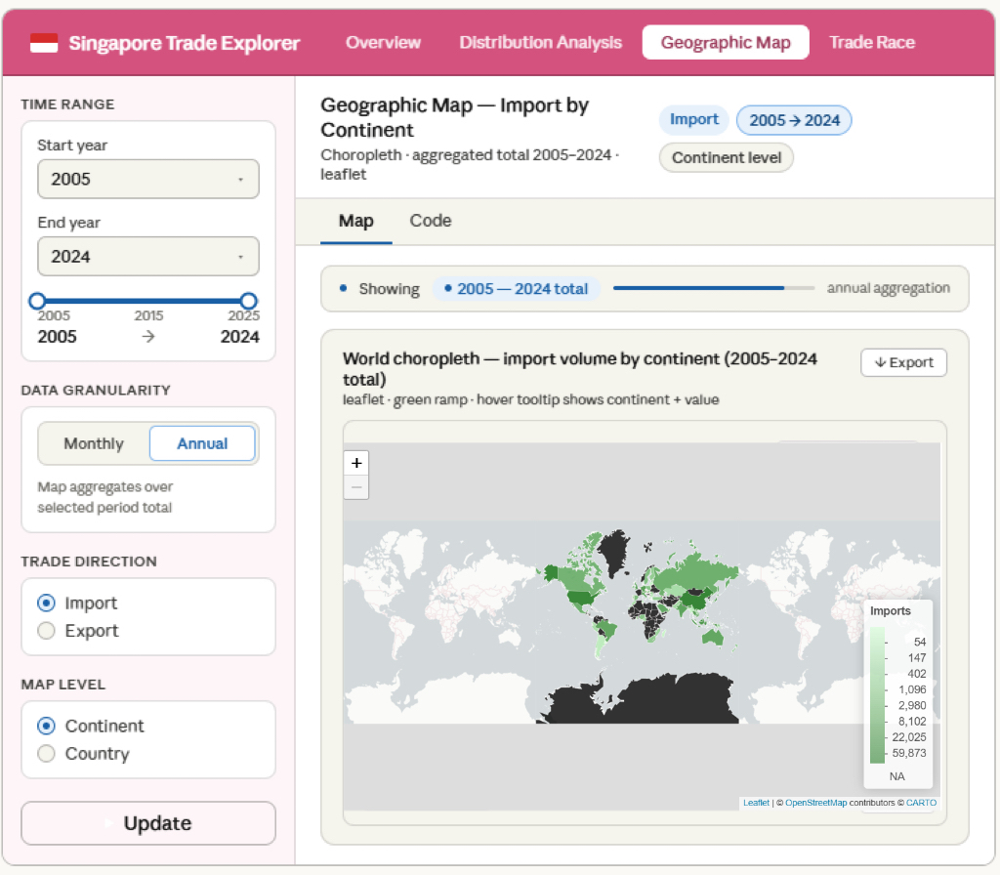
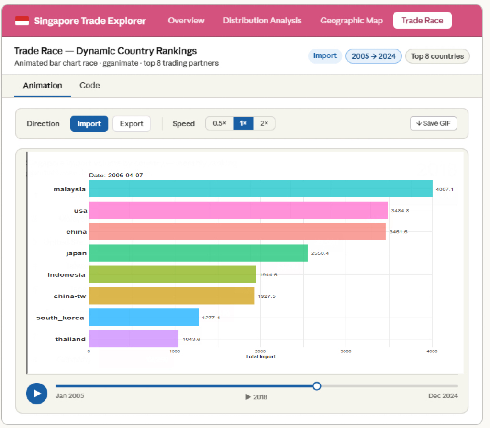

# **Macro exploration and geographical analysis of Singapore's trading volume**

## **1 Exploratory Data Analysis**

### **1.1 Packages**

```{r}
pacman::p_load(shiny,leaflet,plotly,readxl, ggdist, ggridges, ggthemes,gganimate,ggstatsplot,transformr,lubridate,sf,rnaturalearth,rnaturalearthdata,countrycode,ggplot2,sf,gifski,av,scales,hrbrthemes,colorspace, tidyverse, DT,dplyr,tidyr, maps,ggrepel,VennDiagram,grid,fable,tsibble,feasts,kableExtra,knitr)
```

### **1.2 Desriptive Statistics**

Use R language and tidyverse for data processing, and summarize monthly raw data into an annual total. This table provides a comprehensive exploratory data analysis of import transactions with over 80 trading partners. It summarizes the historical performance of each country across multiple statistical dimensions, with a focus on central trends, variability, and long-term growth trends, and can be input to search for specific country data.

Stability (CV%): coefficient of variation. The higher the CV, the more volatile the trade between the country and Singapore; The lower the CV, the more stable the trade relationship.

Total Growth (%): Reflects the cumulative changes in the country's total trade volume from 2005 to 2025.

#### 1.2.1 Import data

::: panel-tabset
## Plot

```{r}
#| echo: false
#| warning: false
#| message: false
import_data <- read_excel("data/Import.xlsx")

data_long <- import_data %>%
  pivot_longer(-Month, names_to = "region", values_to = "total") %>%
  mutate(
    date = Month,        
    year = year(Month)   
  )

continents <- c("America","Asia","Europe","Oceania","Africa")

continent_data <- data_long %>%
  filter(region %in% continents) %>%
  group_by(region, year) %>%
  summarise(total = sum(total, na.rm=TRUE), .groups="drop")
country_data <- data_long %>%
  filter(!region %in% continents) %>%
  mutate(
    iso3 = countrycode(region, "country.name", "iso3c") 
  ) %>%
  filter(!is.na(iso3)) 
continents <- c("America", "Asia", "Europe", "Oceania", "Africa", "EU", "Indonesia")
import_long <- import_data %>%
  mutate(year = year(Month)) %>%
  pivot_longer(cols = -c(Month, year), 
               names_to = "Country", 
               values_to = "Value") %>%
  filter(!Country %in% continents) %>% 
  filter(!is.na(Value))

year_totals <- import_long %>%
  group_by(year) %>%
  summarise(global_annual_total = sum(Value, na.rm = TRUE), .groups = "drop")

import_summary <- import_long %>%
  group_by(Country, year) %>%
  summarise(annual_total = sum(Value, na.rm = TRUE), .groups = "drop") %>%
  left_join(year_totals, by = "year") %>%
  group_by(Country) %>%
  summarise(
    Min = min(annual_total),
    Max = max(annual_total),
    Mean = mean(annual_total),
    `Std. dev.` = sd(annual_total),
    `Stability (CV%)` = (sd(annual_total) / mean(annual_total)) * 100,
    `Total Growth (%)` = (last(annual_total, order_by = year) - first(annual_total, order_by = year)) / first(annual_total, order_by = year) * 100,
    `CAGR (%)` = ((last(annual_total, order_by = year) / first(annual_total, order_by = year))^(1/(max(year) - min(year))) - 1) * 100,
    `Avg Market Share (%)` = mean(annual_total / global_annual_total, na.rm = TRUE) * 100,
    `Peak Year` = year[which.max(annual_total)],
    .groups = "drop"
  )

datatable(import_summary, 
          class = "hover nowrap", 
          options = list(pageLength = 10, scrollX = TRUE),
          caption = 'Deep statistical analysis of import data from 2005 to 2025 (summarized annually)') %>%
  formatRound(columns = c("Min", "Max", "Mean", "Std. dev."), digits = 2) %>%
  formatRound(columns = c("Stability (CV%)", "Total Growth (%)", "CAGR (%)", "Avg Market Share (%)"), digits = 1)
```

## Code

```{r}
#| eval: false
#| warning: false
#| message: false
import_data <- read_excel("data/Import.xlsx")

data_long <- import_data %>%
  pivot_longer(-Month, names_to = "region", values_to = "total") %>%
  mutate(
    date = Month,        
    year = year(Month)   
  )

continents <- c("America","Asia","Europe","Oceania","Africa")

continent_data <- data_long %>%
  filter(region %in% continents) %>%
  group_by(region, year) %>%
  summarise(total = sum(total, na.rm=TRUE), .groups="drop")
country_data <- data_long %>%
  filter(!region %in% continents) %>%
  mutate(
    iso3 = countrycode(region, "country.name", "iso3c") 
  ) %>%
  filter(!is.na(iso3)) 
continents <- c("America", "Asia", "Europe", "Oceania", "Africa", "EU", "Indonesia")
import_long <- import_data %>%
  mutate(year = year(Month)) %>%
  pivot_longer(cols = -c(Month, year), 
               names_to = "Country", 
               values_to = "Value") %>%
  filter(!Country %in% continents) %>% 
  filter(!is.na(Value))

year_totals <- import_long %>%
  group_by(year) %>%
  summarise(global_annual_total = sum(Value, na.rm = TRUE), .groups = "drop")

import_summary <- import_long %>%
  group_by(Country, year) %>%
  summarise(annual_total = sum(Value, na.rm = TRUE), .groups = "drop") %>%
  left_join(year_totals, by = "year") %>%
  group_by(Country) %>%
  summarise(
    Min = min(annual_total),
    Max = max(annual_total),
    Mean = mean(annual_total),
    `Std. dev.` = sd(annual_total),
    `Stability (CV%)` = (sd(annual_total) / mean(annual_total)) * 100,
    `Total Growth (%)` = (last(annual_total, order_by = year) - first(annual_total, order_by = year)) / first(annual_total, order_by = year) * 100,
    `CAGR (%)` = ((last(annual_total, order_by = year) / first(annual_total, order_by = year))^(1/(max(year) - min(year))) - 1) * 100,
    `Avg Market Share (%)` = mean(annual_total / global_annual_total, na.rm = TRUE) * 100,
    `Peak Year` = year[which.max(annual_total)],
    .groups = "drop"
  )

datatable(import_summary, 
          class = "hover nowrap", 
          options = list(pageLength = 10, scrollX = TRUE),
          caption = 'Deep statistical analysis of import data from 2005 to 2025 (summarized annually)') %>%
  formatRound(columns = c("Min", "Max", "Mean", "Std. dev."), digits = 2) %>%
  formatRound(columns = c("Stability (CV%)", "Total Growth (%)", "CAGR (%)", "Avg Market Share (%)"), digits = 1)
```
:::

#### 1.2.2 Export data

::: panel-tabset
## Plot

```{r}
#| echo: false
#| warning: false
#| message: false
export_data <- read_excel("data/Export.xlsx")
continents <- c("America", "Asia", "Europe", "Oceania", "Africa","EU")
export_long <- export_data %>%
  mutate(year = year(Month)) %>%
  pivot_longer(cols = -c(Month, year), 
               names_to = "Country", 
               values_to = "Value") %>%
  filter(!Country %in% continents) %>% 
  filter(!is.na(Value))

year_totals <- export_long %>%
  group_by(year) %>%
  summarise(global_annual_total = sum(Value, na.rm = TRUE), .groups = "drop")

import_summary <- export_long %>%
  group_by(Country, year) %>%
  summarise(annual_total = sum(Value, na.rm = TRUE), .groups = "drop") %>%
  left_join(year_totals, by = "year") %>%
  group_by(Country) %>%
  summarise(
    Min = min(annual_total),
    Max = max(annual_total),
    Mean = mean(annual_total),
    `Std. dev.` = sd(annual_total),
    `Stability (CV%)` = (sd(annual_total) / mean(annual_total)) * 100,
    `Total Growth (%)` = (last(annual_total, order_by = year) - first(annual_total, order_by = year)) / first(annual_total, order_by = year) * 100,
    `CAGR (%)` = ((last(annual_total, order_by = year) / first(annual_total, order_by = year))^(1/(max(year) - min(year))) - 1) * 100,
    `Avg Market Share (%)` = mean(annual_total / global_annual_total, na.rm = TRUE) * 100,
    `Peak Year` = year[which.max(annual_total)],
    .groups = "drop"
  )

datatable(import_summary, 
          class = "hover nowrap", 
          options = list(pageLength = 10, scrollX = TRUE),
          caption = 'Deep statistical analysis of export data from 2005 to 2025 (summarized annually)') %>%
  formatRound(columns = c("Min", "Max", "Mean", "Std. dev."), digits = 2) %>%
  formatRound(columns = c("Stability (CV%)", "Total Growth (%)", "CAGR (%)", "Avg Market Share (%)"), digits = 1)
```

## code

```{r}
#| eval: false
#| warning: false
#| message: false
export_data <- read_excel("data/Export.xlsx")
continents <- c("America", "Asia", "Europe", "Oceania", "Africa","EU")
export_long <- export_data %>%
  mutate(year = year(Month)) %>%
  pivot_longer(cols = -c(Month, year), 
               names_to = "Country", 
               values_to = "Value") %>%
  filter(!Country %in% continents) %>% 
  filter(!is.na(Value))

year_totals <- export_long %>%
  group_by(year) %>%
  summarise(global_annual_total = sum(Value, na.rm = TRUE), .groups = "drop")

import_summary <- export_long %>%
  group_by(Country, year) %>%
  summarise(annual_total = sum(Value, na.rm = TRUE), .groups = "drop") %>%
  left_join(year_totals, by = "year") %>%
  group_by(Country) %>%
  summarise(
    Min = min(annual_total),
    Max = max(annual_total),
    Mean = mean(annual_total),
    `Std. dev.` = sd(annual_total),
    `Stability (CV%)` = (sd(annual_total) / mean(annual_total)) * 100,
    `Total Growth (%)` = (last(annual_total, order_by = year) - first(annual_total, order_by = year)) / first(annual_total, order_by = year) * 100,
    `CAGR (%)` = ((last(annual_total, order_by = year) / first(annual_total, order_by = year))^(1/(max(year) - min(year))) - 1) * 100,
    `Avg Market Share (%)` = mean(annual_total / global_annual_total, na.rm = TRUE) * 100,
    `Peak Year` = year[which.max(annual_total)],
    .groups = "drop"
  )

datatable(import_summary, 
          class = "hover nowrap", 
          options = list(pageLength = 10, scrollX = TRUE),
          caption = 'Deep statistical analysis of export data from 2005 to 2025 (summarized annually)') %>%
  formatRound(columns = c("Min", "Max", "Mean", "Std. dev."), digits = 2) %>%
  formatRound(columns = c("Stability (CV%)", "Total Growth (%)", "CAGR (%)", "Avg Market Share (%)"), digits = 1)
```
:::

### **1.3 Trade Distribution by Continent**

This chart uses a composite statistical method (violin plot, box plot combined with raw scatter points) to deeply analyze the monthly trade distribution characteristics of Singapore on different continents: it shows the core position of the Asian market, while the trade volume in Oceania and Africa is relatively small and concentrated; And the violins in Asia and Europe are longer, indicating that the trade between these two regions is not only large-scale, but also more volatile at different times.

#### 1.3.1 Import distribution

::: panel-tabset
## Plot

```{r}
#| echo: false
#| warning: false
#| message: false
plot_ANOVA_continents <- function(data, 
                                  testtype = "np", 
                                  pair = "ns", 
                                  conf = 0.95, 
                                  nooutliers = T) {

  continent_cols <- c("America", "Asia", "Europe", "Oceania", "Africa")
  
  data_long <- data %>%
    select(Month, all_of(continent_cols)) %>%
    pivot_longer(cols = all_of(continent_cols), 
                 names_to = "continent", 
                 values_to = "value") %>%
    drop_na(value)

  if(nooutliers == TRUE){}

  paratext <- case_when(
    testtype == "p" ~ "Mean (Parametric)",
    testtype == "np" ~ "Median (Non-Parametric)",
    testtype == "r" ~ "Mean (Robust t-test)",
    testtype == "bayes" ~ "Mean (Bayesian)"
  )

  data_long %>%
    ggbetweenstats(
      x = continent, 
      y = value,
      xlab = "Continent", 
      ylab = "Import Value",
      type = testtype, 
      pairwise.comparisons = TRUE, 
      pairwise.display = pair, 
      mean.ci = TRUE, 
      p.adjust.method = "fdr", 
      conf.level = conf,
      title = paste0("Comparison of ", paratext, " Import Value across Continents"),
      package = "ggthemes", 
      palette = "Tableau_10"
    )
}
plot_ANOVA_continents(import_data, testtype = "np", pair = "ns")
```

## code

```{r}
#| eval: false
#| warning: false
#| message: false
plot_ANOVA_continents <- function(data, 
                                  testtype = "np", 
                                  pair = "ns", 
                                  conf = 0.95, 
                                  nooutliers = T) {

  continent_cols <- c("America", "Asia", "Europe", "Oceania", "Africa")
  
  data_long <- data %>%
    select(Month, all_of(continent_cols)) %>%
    pivot_longer(cols = all_of(continent_cols), 
                 names_to = "continent", 
                 values_to = "value") %>%
    drop_na(value)

  if(nooutliers == TRUE){}

  paratext <- case_when(
    testtype == "p" ~ "Mean (Parametric)",
    testtype == "np" ~ "Median (Non-Parametric)",
    testtype == "r" ~ "Mean (Robust t-test)",
    testtype == "bayes" ~ "Mean (Bayesian)"
  )

  data_long %>%
    ggbetweenstats(
      x = continent, 
      y = value,
      xlab = "Continent", 
      ylab = "Import Value",
      type = testtype, 
      pairwise.comparisons = TRUE, 
      pairwise.display = pair, 
      mean.ci = TRUE, 
      p.adjust.method = "fdr", 
      conf.level = conf,
      title = paste0("Comparison of ", paratext, " Import Value across Continents"),
      package = "ggthemes", 
      palette = "Tableau_10"
    )
}
plot_ANOVA_continents(import_data, testtype = "np", pair = "ns")
```
:::

#### 1.3.2 Export Distribution

::: panel-tabset
## Plot

```{r}
#| echo: false
#| warning: false
#| message: false
plot_ANOVA_continents_ex <- function(data, 
                                  testtype = "np", 
                                  pair = "ns", 
                                  conf = 0.95, 
                                  nooutliers = T) {

  continent_cols <- c("America", "Asia", "Europe", "Oceania", "Africa")
  
  data_long <- data %>%
    select(Month, all_of(continent_cols)) %>%
    pivot_longer(cols = all_of(continent_cols), 
                 names_to = "continent", 
                 values_to = "value") %>%
    drop_na(value)

  if(nooutliers == TRUE){}

  paratext <- case_when(
    testtype == "p" ~ "Mean (Parametric)",
    testtype == "np" ~ "Median (Non-Parametric)",
    testtype == "r" ~ "Mean (Robust t-test)",
    testtype == "bayes" ~ "Mean (Bayesian)"
  )

  data_long %>%
    ggbetweenstats(
      x = continent, 
      y = value,
      xlab = "Continent", 
      ylab = "Export Value",
      type = testtype, 
      pairwise.comparisons = TRUE, 
      pairwise.display = pair, 
      mean.ci = TRUE, 
      p.adjust.method = "fdr", 
      conf.level = conf,
      title = paste0("Comparison of ", paratext, " Export Value across Continents"),
      package = "ggthemes", 
      palette = "Tableau_10"
    )
}

plot_ANOVA_continents_ex(export_data, testtype = "np", pair = "ns")
```

## code

```{r}
#| eval: false
#| warning: false
#| message: false
plot_ANOVA_continents_ex <- function(data, 
                                  testtype = "np", 
                                  pair = "ns", 
                                  conf = 0.95, 
                                  nooutliers = T) {

  continent_cols <- c("America", "Asia", "Europe", "Oceania", "Africa")
  
  data_long <- data %>%
    select(Month, all_of(continent_cols)) %>%
    pivot_longer(cols = all_of(continent_cols), 
                 names_to = "continent", 
                 values_to = "value") %>%
    drop_na(value)

  if(nooutliers == TRUE){}

  paratext <- case_when(
    testtype == "p" ~ "Mean (Parametric)",
    testtype == "np" ~ "Median (Non-Parametric)",
    testtype == "r" ~ "Mean (Robust t-test)",
    testtype == "bayes" ~ "Mean (Bayesian)"
  )

  data_long %>%
    ggbetweenstats(
      x = continent, 
      y = value,
      xlab = "Continent", 
      ylab = "Export Value",
      type = testtype, 
      pairwise.comparisons = TRUE, 
      pairwise.display = pair, 
      mean.ci = TRUE, 
      p.adjust.method = "fdr", 
      conf.level = conf,
      title = paste0("Comparison of ", paratext, " Export Value across Continents"),
      package = "ggthemes", 
      palette = "Tableau_10"
    )
}

plot_ANOVA_continents_ex(export_data, testtype = "np", pair = "ns")
```
:::

### **1.4 Important trading partners: Top 10 Import and Export Intersections**

Statistically rank the top 10 important trading partners for Singapore's total import and export volume from 2005 to 2025, with a focus on identifying and using Venn Diagrams to display the 8 common trading partners. Conduct more in-depth research on these 8 countries in subsequent EDA and CDA.

::: panel-tabset
## Plot

```{r}
#| echo: false
#| warning: false
#| message: false
import_long <- import_data %>%
  pivot_longer(-Month, names_to = "region", values_to = "total")

export_long <- export_data %>%
  pivot_longer(-Month, names_to = "region", values_to = "total")
continents <- c("America","Asia","Europe","Oceania","Africa","EU", "United Arab Emirates","Total", "World")
start_date <- as.Date("2005-01-01")
end_date   <- as.Date("2025-12-31")

top10_import <- import_long %>%
  filter(Month >= start_date & Month <= end_date) %>% 
  filter(!region %in% continents) %>%                  
  group_by(region) %>%
  summarise(total_sum = sum(total, na.rm = TRUE)) %>%  
  arrange(desc(total_sum)) %>%
  slice_head(n = 10)
top10_export <- export_long %>%
  filter(Month >= start_date & Month <= end_date) %>% 
  filter(!region %in% continents) %>%                  
  group_by(region) %>%
  summarise(total_sum = sum(total, na.rm = TRUE)) %>%  
  arrange(desc(total_sum)) %>%
  slice_head(n = 10)
common_table <- inner_join(
  top10_import,
  top10_export,
  by = "region",
  suffix = c("_import", "_export")
)
common_countries <- intersect(top10_import$region, top10_export$region)
import_only <- setdiff(top10_import$region, top10_export$region)
export_only <- setdiff(top10_export$region, top10_import$region)
grid.newpage()
venn.plot <- draw.pairwise.venn(
  area1 = length(top10_import$region),
  area2 = length(top10_export$region),
  cross.area = length(common_countries),

  category = c("Import Top10", "Export Top10"),

  fill = c("#66BB6A", "#FF8A65"),  
  alpha = 0.35,                   

  cat.cex = 1.2,
  cex = 0, 
  cat.pos = c(-30, 30), 
  cat.dist = c(0.05, 0.05), 
  ind = FALSE
)

grid.draw(venn.plot)

grid.text(
  paste(import_only, collapse = "\n"),
  x = 0.11, y = 0.50,
  gp = gpar(fontsize = 10)
)

grid.text(
  paste(export_only, collapse = "\n"),
  x = 0.89, y = 0.50,
  gp = gpar(fontsize = 10)
)

grid.text(
  paste(common_countries, collapse = "\n"),
  x = 0.50, y = 0.50,
  gp = gpar(fontsize = 10, fontface = "bold")
)
```

## code

```{r}
#| eval: false
#| warning: false
#| message: false
import_long <- import_data %>%
  pivot_longer(-Month, names_to = "region", values_to = "total")

export_long <- export_data %>%
  pivot_longer(-Month, names_to = "region", values_to = "total")
continents <- c("America","Asia","Europe","Oceania","Africa","EU", "United Arab Emirates","Total", "World")
start_date <- as.Date("2005-01-01")
end_date   <- as.Date("2025-12-31")

top10_import <- import_long %>%
  filter(Month >= start_date & Month <= end_date) %>% 
  filter(!region %in% continents) %>%                  
  group_by(region) %>%
  summarise(total_sum = sum(total, na.rm = TRUE)) %>%  
  arrange(desc(total_sum)) %>%
  slice_head(n = 10)
top10_export <- export_long %>%
  filter(Month >= start_date & Month <= end_date) %>% 
  filter(!region %in% continents) %>%                  
  group_by(region) %>%
  summarise(total_sum = sum(total, na.rm = TRUE)) %>%  
  arrange(desc(total_sum)) %>%
  slice_head(n = 10)
common_table <- inner_join(
  top10_import,
  top10_export,
  by = "region",
  suffix = c("_import", "_export")
)
common_countries <- intersect(top10_import$region, top10_export$region)
import_only <- setdiff(top10_import$region, top10_export$region)
export_only <- setdiff(top10_export$region, top10_import$region)
grid.newpage()
venn.plot <- draw.pairwise.venn(
  area1 = length(top10_import$region),
  area2 = length(top10_export$region),
  cross.area = length(common_countries),

  category = c("Import Top10", "Export Top10"),

  fill = c("#66BB6A", "#FF8A65"),  
  alpha = 0.35,                   

  cat.cex = 1.2,
  cex = 0, 
  cat.pos = c(-30, 30), 
  cat.dist = c(0.05, 0.05), 
  ind = FALSE
)

grid.draw(venn.plot)

grid.text(
  paste(import_only, collapse = "\n"),
  x = 0.11, y = 0.50,
  gp = gpar(fontsize = 10)
)

grid.text(
  paste(export_only, collapse = "\n"),
  x = 0.89, y = 0.50,
  gp = gpar(fontsize = 10)
)

grid.text(
  paste(common_countries, collapse = "\n"),
  x = 0.50, y = 0.50,
  gp = gpar(fontsize = 10, fontface = "bold")
)
```
:::

### **1.5 Trade Race**

This bar chart competition is rendered using the gganimate package, which has a view_follow() function that allows for dynamic scaling of the x-axis, ensuring that even if global trade volume fluctuates over time, the "competition" remains visually focused on top competitors. Visualized the dynamic changes of Singapore's major import sources over the past two decades, capturing real-time ranking competition among important trading partners.

#### 1.5.1 Import Trade Race

::: panel-tabset
## Plot

\

## code

```{r}
#| eval: false
#| warning: false
#| message: false
top8importdata <- read_excel("data/top8data.xlsx")

plot_data <- top8importdata %>%
  filter(category == "import") %>%
  mutate(date = as.Date(paste(year, month, "01", sep = "-"))) %>%
  group_by(date) %>%
  mutate(rank = rank(-total, ties.method = "first")) %>%
  ungroup()
anim <- ggplot(plot_data, aes(x = rank, y = total, fill = country)) +
  geom_col(width = 0.8, alpha = 0.7, color = NA) +
  geom_text(aes(y = 0, label = country), 
            hjust = 1.1, size = 5, fontface = "bold", color = "grey20") +
  geom_text(aes(label = as.character(round(total, 1))), 
            hjust = -0.2, size = 4, color = "grey30") +
  coord_flip(clip = "off", expand = FALSE) +
  scale_x_reverse() +
  theme_minimal() +
  theme(
    axis.line = element_blank(),
    axis.text.y = element_blank(),
    axis.title.y = element_blank(),
    legend.position = "none",
    plot.margin = margin(2, 2, 2, 4, "cm")
  ) +
  labs(
    title = 'Singapore Import Volume by Country',
    subtitle = 'Date: {frame_time}',
    x = "", 
    y = "Total Import"
  ) +
  transition_time(date) +
  view_follow(fixed_x = TRUE)
final_anim <- animate(anim, 
                      nframes = 200, 
                      fps = 10, 
                      width = 800, 
                      height = 600, 
                      renderer = gifski_renderer())
anim_save("Singapore_Import.gif", final_anim)
```
:::

#### 1.5.2 Export Trade Race

::: panel-tabset
## Plot

\

## code

```{r}
#| eval: false
#| warning: false
#| message: false
top8exportdata <- read_excel("data/top8data.xlsx")

plot_data_export <- top8exportdata %>%
  filter(category == "export") %>%
  mutate(date = as.Date(paste(year, month, "01", sep = "-"))) %>%
  group_by(date) %>%
  mutate(rank = rank(-total, ties.method = "first")) %>%
  ungroup()
anim_export <- ggplot(plot_data_export, aes(x = rank, y = total, fill = country)) +
  geom_col(width = 0.8, alpha = 0.7, color = NA) +
  geom_text(aes(y = 0, label = country), 
            hjust = 1.1, size = 5, fontface = "bold", color = "grey20") +
  geom_text(aes(label = as.character(round(total, 1))), 
            hjust = -0.2, size = 4, color = "grey30") +
  coord_flip(clip = "off", expand = FALSE) +
  scale_x_reverse() +
  theme_minimal() +
  theme(
    axis.line = element_blank(),
    axis.text.y = element_blank(),
    axis.title.y = element_blank(),
    legend.position = "none",
    plot.margin = margin(2, 2, 2, 4, "cm")
  ) +
  labs(
    title = 'Singapore Export Volume by Country',
    subtitle = 'Date: {frame_time}',
    x = "", 
    y = "Total Export"
  ) +
  transition_time(date) +
  view_follow(fixed_x = TRUE)
final_export_anim <- animate(anim_export, 
                             nframes = 200, 
                             fps = 10, 
                             width = 800, 
                             height = 600, 
                             renderer = gifski_renderer())

anim_save("Singapore_Export.gif", final_export_anim)
```
:::

## **2 Time Series Prediction**

The visualization displays the expected trade trajectory of Singapore's top 8 partners as of December 2026. Using the ETS (Seasonal Error Trends) model, seasonal and structural trends for each country were predicted (highlighted in blue).

Trade data exhibits strong seasonality, such as a decrease in exports during the Spring Festival in January and February, and an increase in demand during the year-end holiday season. Directly predicting the annual total will lose these key fluctuations; By predicting the monthly volume from February to December 2026 and summing it up, seasonal trends can be captured, resulting in more scientific results. The first graph shows the import and export trends of the forecast results from 2023 to 2026.

::: panel-tabset
## Plot

```{r}
#| echo: false
#| warning: false
#| message: false
top8data <- read_excel("data/top8data.xlsx")
ts_data <- top8data %>%
  mutate(date = yearmonth(paste(year, month, "01", sep = "-"))) %>%
  as_tsibble(index = date, key = c(country, category)) 

fit <- ts_data %>% model(ets_model = ETS(total))
fc <- fit %>% forecast(h = "11 months")

p <- fc %>%
  filter_index("2024 Jan" ~ .) %>% 
  autoplot(ts_data) +
  facet_grid(category ~ country, scales = "free_y") +
  scale_x_yearmonth(date_breaks = "1 year", date_labels = "%Y") + 
  theme_minimal() +
  theme(
    strip.text = element_text(face = "bold", size = 9),
    panel.spacing = unit(0.5, "lines"),
    legend.position = "bottom",
    axis.text.x = element_blank()
  ) +
  labs(title = "Forecasted Trade Trends for 2026",
       subtitle = "Displaying annual markers for clarity",
       x = "Year", y = "Trade Value")

print(p)
prediction_table <- fc %>%
  as_tibble() %>%
  group_by(country, category) %>%
  summarise(Forecast_2026_Total = sum(.mean), .groups = "drop") %>%
  mutate(Forecast_2026_Total = round(Forecast_2026_Total, 2)) %>%
  pivot_wider(names_from = category, values_from = Forecast_2026_Total)
prediction_table %>%
  kable(caption = "Projected Annual Trade Volume for 2026 by Country (S$ Million)",
        format = "html") %>%
  kable_styling(bootstrap_options = c("striped", "hover", "condensed"), 
                full_width = F, 
                position = "left") %>%
  column_spec(1, bold = T, border_right = "1px solid #ddd")
```

## code

```{r}
#| eval: false
#| warning: false
#| message: false
top8data <- read_excel("data/top8data.xlsx")
ts_data <- top8data %>%
  mutate(date = yearmonth(paste(year, month, "01", sep = "-"))) %>%
  as_tsibble(index = date, key = c(country, category)) 

fit <- ts_data %>% model(ets_model = ETS(total))
fc <- fit %>% forecast(h = "11 months")

p <- fc %>%
  filter_index("2024 Jan" ~ .) %>% 
  autoplot(ts_data) +
  facet_grid(category ~ country, scales = "free_y") +
  scale_x_yearmonth(date_breaks = "1 year", date_labels = "%Y") + 
  theme_minimal() +
  theme(
    strip.text = element_text(face = "bold", size = 9),
    panel.spacing = unit(0.5, "lines"),
    legend.position = "bottom",
    axis.text.x = element_blank()
  ) +
  labs(title = "Forecasted Trade Trends for 2026",
       subtitle = "Displaying annual markers for clarity",
       x = "Year", y = "Trade Value")

print(p)
prediction_table <- fc %>%
  as_tibble() %>%
  group_by(country, category) %>%
  summarise(Forecast_2026_Total = sum(.mean), .groups = "drop") %>%
  mutate(Forecast_2026_Total = round(Forecast_2026_Total, 2)) %>%
  pivot_wider(names_from = category, values_from = Forecast_2026_Total)
prediction_table %>%
  kable(caption = "Projected Annual Trade Volume for 2026 by Country (S$ Million)",
        format = "html") %>%
  kable_styling(bootstrap_options = c("striped", "hover", "condensed"), 
                full_width = F, 
                position = "left") %>%
  column_spec(1, bold = T, border_right = "1px solid #ddd")
```
:::

## **3 Geographical analysis display**

### **3.1 World heat map of trade volume(Continent)**

The interactive Choropleth map (heatmap) provides a spatial overview of Singapore's trade sources classified by continent. By converting trade volume into color gradients, the map immediately highlights the main geographic centers of Singapore's supply chain.

#### 3.1.1 World heat map of import volume(Continent)

::: panel-tabset
## Plot

\

## code

```{r}
#| eval: false
#| warning: false
#| message: false
data_long <- import_data %>%
  pivot_longer(-Month, names_to = "region", values_to = "total") %>%
  mutate(
    date = Month,        
    year = year(Month)   
  )

continents <- c("America","Asia","Europe","Oceania","Africa")
continent_data <- data_long %>% filter(region %in% continents)

america_row <- continent_data %>% filter(region == "America")
america_split <- america_row %>%
  tidyr::uncount(2) %>%  
  mutate(region = rep(c("North America","South America"), times = nrow(america_row)))

continent_data_fixed <- continent_data %>%
  filter(region != "America") %>%
  bind_rows(america_split)

world <- ne_countries(scale = "small", returnclass = "sf")

continent_map <- world %>%
  left_join(continent_data_fixed, by = c("continent" = "region"))


pal_green <- colorNumeric(
  palette = colorRampPalette(c("#CCFFCC","#006400"))(5),
  domain = continent_map$total,
  na.color = "grey90"
)

leaflet(continent_map) %>%
  addProviderTiles(providers$CartoDB.Positron) %>%
  addPolygons(
    fillColor = ~pal_green(total),
    weight = 1,
    color = "white",
    fillOpacity = 0.8,
    label = ~paste(continent, ": ", total)
  ) %>%
  addLegend(
    "bottomright",
    pal = pal_green,
    values = continent_map$total,
    title = "Import by Continent"
  )
```
:::

#### 3.1.2 World heat map of export volume(Continent)

::: panel-tabset
## Plot

\

## code

```{r}
#| eval: false
#| warning: false
#| message: false
data_long <- export_data %>%
  pivot_longer(-Month, names_to = "region", values_to = "total") %>%
  mutate(
    date = Month,        
    year = year(Month)   
  )

continents <- c("America","Asia","Europe","Oceania","Africa")
continent_data <- data_long %>% filter(region %in% continents)

america_row <- continent_data %>% filter(region == "America")
america_split <- america_row %>%
  tidyr::uncount(2) %>%  
  mutate(region = rep(c("North America","South America"), times = nrow(america_row)))

continent_data_fixed <- continent_data %>%
  filter(region != "America") %>%
  bind_rows(america_split)

world <- ne_countries(scale = "small", returnclass = "sf")

continent_map <- world %>%
  left_join(continent_data_fixed, by = c("continent" = "region"))


pal_red <- colorNumeric(
  palette = colorRampPalette(c("#FFE5E5", "#8B0000"))(5),
  domain = continent_map$total,
  na.color = "grey90"
)

leaflet(continent_map) %>%
  addProviderTiles(providers$CartoDB.Positron) %>%
  addPolygons(
    fillColor = ~pal_red(total),
    weight = 1,
    color = "white",
    fillOpacity = 0.8,
    label = ~paste(continent, ": ", total)
  ) %>%
  addLegend(
    "bottomright",
    pal = pal_red,
    values = continent_map$total,
    title = "Export by Continent"
  )
```
:::

### **3.2 World heat map of trade volume(Country)**

By mapping trade value to ISO-3 country codes, financial transaction data is linked to precise geographic boundaries, further visualize at the national level and segment the general trends of the mainland into specific national markets. It enables us to accurately determine which economies on these continents are driving Singapore's import and export growth, while observing their geographical connections.

#### 3.2.1 World heat map of import volume(Country)

::: panel-tabset
## Plot

```{r}
#| echo: false
#| warning: false
#| message: false
trade_agg <- country_data %>%
  group_by(iso3, year) %>%
  summarise(total = sum(total, na.rm=TRUE), .groups="drop")
 
manual_iso <- c(
  "Antigua and Barbuda" = "ATG",
  "Bahamas" = "BHS",
  "Panama" = "PAN"
)

country_data <- country_data %>%
  mutate(iso3 = if_else(is.na(iso3), manual_iso[region], iso3))
world <- ne_countries(scale="medium", returnclass="sf")

selected_year <- 2025
trade_year <- trade_agg %>% filter(year == selected_year)

trade_map <- world %>%
  left_join(trade_year, by = c("iso_a3" = "iso3"))

trade_map_sf <- st_as_sf(trade_map)
world <- ne_countries(scale = "medium", returnclass = "sf")
trade_map <- world %>% left_join(trade_year, by = c("iso_a3" = "iso3"))
trade_map_sf <- st_as_sf(trade_map)

pal_green_log <- colorNumeric(
  palette = colorRampPalette(c("#CCFFCC","#006400"))(10),
  domain = log1p(trade_map_sf$total),
  na.color = "grey90"
)

leaflet(trade_map_sf) %>%
  addProviderTiles(providers$CartoDB.Positron) %>%
  addPolygons(
    fillColor = ~pal_green_log(log1p(total)),
    weight = 0.5,
    color = "white",
    fillOpacity = 0.8,
    label = ~paste(name, ": ", total)
  ) %>%
  addLegend(
    "bottomright",
    pal = pal_green_log,
    values = log1p(trade_map_sf$total),  
    labFormat = labelFormat(transform = function(x) round(expm1(x),0)), 
    title = "Imports"
  )
```

## code

```{r}
#| eval: false
#| warning: false
#| message: false
trade_agg <- country_data %>%
  group_by(iso3, year) %>%
  summarise(total = sum(total, na.rm=TRUE), .groups="drop")

manual_iso <- c(
  "Antigua and Barbuda" = "ATG",
  "Bahamas" = "BHS",
  "Panama" = "PAN"
)

country_data <- country_data %>%
  mutate(iso3 = if_else(is.na(iso3), manual_iso[region], iso3))
world <- ne_countries(scale="medium", returnclass="sf")

selected_year <- 2025
trade_year <- trade_agg %>% filter(year == selected_year)

trade_map <- world %>%
  left_join(trade_year, by = c("iso_a3" = "iso3"))

trade_map_sf <- st_as_sf(trade_map)
world <- ne_countries(scale = "medium", returnclass = "sf")
trade_map <- world %>% left_join(trade_year, by = c("iso_a3" = "iso3"))
trade_map_sf <- st_as_sf(trade_map)

pal_green_log <- colorNumeric(
  palette = colorRampPalette(c("#CCFFCC","#006400"))(10),
  domain = log1p(trade_map_sf$total),
  na.color = "grey90"
)

leaflet(trade_map_sf) %>%
  addProviderTiles(providers$CartoDB.Positron) %>%
  addPolygons(
    fillColor = ~pal_green_log(log1p(total)),
    weight = 0.5,
    color = "white",
    fillOpacity = 0.8,
    label = ~paste(name, ": ", total)
  ) %>%
  addLegend(
    "bottomright",
    pal = pal_green_log,
    values = log1p(trade_map_sf$total),  
    labFormat = labelFormat(transform = function(x) round(expm1(x),0)), 
    title = "Imports"
  )
```
:::

#### 3.2.2 World heat map of export volume(Country)

::: panel-tabset
## Plot

```{r}
#| echo: false
#| warning: false
#| message: false
data_long <- export_data %>%
  pivot_longer(-Month, names_to = "region", values_to = "total") %>%
  mutate(
    date = Month,        
    year = year(Month)   
  )
continents <- c("America","Asia","Europe","Oceania","Africa")

continent_data <- data_long %>%
  filter(region %in% continents) %>%
  group_by(region, year) %>%
  summarise(total = sum(total, na.rm=TRUE), .groups="drop")
country_data <- data_long %>%
  filter(!region %in% continents) %>%
  mutate(
    iso3 = countrycode(region, "country.name", "iso3c") 
  ) %>%
  filter(!is.na(iso3)) 
trade_agg <- country_data %>%
  group_by(iso3, year) %>%
  summarise(total = sum(total, na.rm=TRUE), .groups="drop")

manual_iso <- c(
  "Antigua and Barbuda" = "ATG",
  "Bahamas" = "BHS",
  "Panama" = "PAN"
)

country_data <- country_data %>%
  mutate(iso3 = if_else(is.na(iso3), manual_iso[region], iso3))
world <- ne_countries(scale="medium", returnclass="sf")

selected_year <- 2025
trade_year <- trade_agg %>% filter(year == selected_year)

trade_map <- world %>%
  left_join(trade_year, by = c("iso_a3" = "iso3"))

trade_map_sf <- st_as_sf(trade_map)
world <- ne_countries(scale = "medium", returnclass = "sf")
trade_map <- world %>% left_join(trade_year, by = c("iso_a3" = "iso3"))
trade_map_sf <- st_as_sf(trade_map)

pal_red_log <- colorNumeric(
  palette = colorRampPalette(c("#FFE5E5", "#8B0000"))(10),
  domain = log1p(trade_map_sf$total[!is.na(trade_map_sf$total)]), 
  na.color = "grey90"
)

leaflet(trade_map_sf) %>%
  addProviderTiles(providers$CartoDB.Positron) %>%
  addPolygons(
    fillColor = ~pal_red_log(log1p(total)),
    weight = 0.5,
    color = "white",
    fillOpacity = 0.8,
    label = ~paste(name, ": ", total)
  ) %>%
  addLegend(
  "bottomright",
  pal = pal_red_log,
  values = log1p(trade_map_sf$total),
  labFormat = labelFormat(transform = function(x) round(expm1(x),0)),
  title = paste("Export Trade -", selected_year)
)
```

## code

```{r}
#| eval: false
#| warning: false
#| message: false
data_long <- export_data %>%
  pivot_longer(-Month, names_to = "region", values_to = "total") %>%
  mutate(
    date = Month,        
    year = year(Month)   
  )
continents <- c("America","Asia","Europe","Oceania","Africa")

continent_data <- data_long %>%
  filter(region %in% continents) %>%
  group_by(region, year) %>%
  summarise(total = sum(total, na.rm=TRUE), .groups="drop")
country_data <- data_long %>%
  filter(!region %in% continents) %>%
  mutate(
    iso3 = countrycode(region, "country.name", "iso3c") 
  ) %>%
  filter(!is.na(iso3)) 
trade_agg <- country_data %>%
  group_by(iso3, year) %>%
  summarise(total = sum(total, na.rm=TRUE), .groups="drop")
manual_iso <- c(
  "Antigua and Barbuda" = "ATG",
  "Bahamas" = "BHS",
  "Panama" = "PAN"
)

country_data <- country_data %>%
  mutate(iso3 = if_else(is.na(iso3), manual_iso[region], iso3))
world <- ne_countries(scale="medium", returnclass="sf")

selected_year <- 2025
trade_year <- trade_agg %>% filter(year == selected_year)

trade_map <- world %>%
  left_join(trade_year, by = c("iso_a3" = "iso3"))

trade_map_sf <- st_as_sf(trade_map)
world <- ne_countries(scale = "medium", returnclass = "sf")
trade_map <- world %>% left_join(trade_year, by = c("iso_a3" = "iso3"))
trade_map_sf <- st_as_sf(trade_map)

pal_red_log <- colorNumeric(
  palette = colorRampPalette(c("#FFE5E5", "#8B0000"))(10),
  domain = log1p(trade_map_sf$total[!is.na(trade_map_sf$total)]), 
  na.color = "grey90"
)

leaflet(trade_map_sf) %>%
  addProviderTiles(providers$CartoDB.Positron) %>%
  addPolygons(
    fillColor = ~pal_red_log(log1p(total)),
    weight = 0.5,
    color = "white",
    fillOpacity = 0.8,
    label = ~paste(name, ": ", total)
  ) %>%
  addLegend(
  "bottomright",
  pal = pal_red_log,
  values = log1p(trade_map_sf$total),
  labFormat = labelFormat(transform = function(x) round(expm1(x),0)),
  title = paste("Export Trade -", selected_year)
)
```
:::

### **3.3 Singapore's Trade Gravity Path**

This graph shows the path of the "geographic center of gravity" of Singapore's import and export market over time by calculating the weighted geographic center of trade volume. If the center of gravity moves north or east, it usually means an increase in dependence on the East Asian (such as China) or North American markets; On the contrary, it may shift towards Southeast Asia or Europe.

#### 3.3.1 Singapore's Import Gravity Path

::: panel-tabset
## Plot

```{r}
#| echo: false
#| warning: false
#| message: false
non_countries <- c("America", "Asia", "Europe", "Oceania", "Africa", "EU", "Total", "World")
world_coords <- map_data("world") %>%
  group_by(region) %>%
  summarise(long = mean(long), lat = mean(lat), .groups = "drop") %>%
  rename(Country = region)
import_long_cleaned <- import_long %>%
  mutate(region = str_trim(region)) %>% 
  filter(!region %in% non_countries) %>% 
  mutate(Country_Match = case_when(
    str_detect(region, "Hong Kong") ~ "China", 
    str_detect(region, "China") ~ "China",
    str_detect(region, "Czech") ~ "Czech Republic",
    str_detect(region, "United Kingdom") ~ "UK",
    TRUE ~ region
  )) %>%
  mutate(year = year(as.Date(Month)),
         Value = total) 
gravity_data <- import_long_cleaned %>%
  left_join(world_coords, by = c("Country_Match" = "Country")) %>%
  filter(!is.na(long)) %>%
  group_by(year) %>%
  summarise(
    center_long = sum(Value * long) / sum(Value),
    center_lat = sum(Value * lat) / sum(Value),
    total_v = sum(Value),
    .groups = "drop"
  )

x_range <- c(min(gravity_data$center_long) - 15, max(gravity_data$center_long) + 15)
y_range <- c(min(gravity_data$center_lat) - 10, max(gravity_data$center_lat) + 10)

ggplot() +
  geom_polygon(data = map_data("world"), aes(x = long, y = lat, group = group), 
               fill = "#f8f9fa", color = "#dee2e6", size = 0.1) +
  
  geom_path(data = gravity_data, aes(x = center_long, y = center_lat, color = year), 
            arrow = arrow(length = unit(0.15, "cm"), type = "closed"), 
            size = 0.8, alpha = 0.6) +
  
  geom_point(data = gravity_data, aes(x = center_long, y = center_lat, size = total_v, fill = year), 
             shape = 21, color = "white", stroke = 0.3, alpha = 0.8) +
  
  geom_text_repel(data = gravity_data %>% filter(year %in% c(2005, 2010, 2015, 2020, 2025)),
                  aes(x = center_long, y = center_lat, label = year),
                  size = 3.5, fontface = "bold", box.padding = 0.8) +
  
  scale_color_viridis_c(option = "plasma", name = "Year") +
  scale_fill_viridis_c(option = "plasma", name = "Year") +
  scale_size_continuous(
    range = c(2, 8), 
    name = "Import Volume",  
    labels = scales::label_comma() 
  ) +
  
  coord_map(xlim = c(min(gravity_data$center_long)-10, max(gravity_data$center_long)+10), 
            ylim = c(min(gravity_data$center_lat)-5, max(gravity_data$center_lat)+5)) +
  
  theme_minimal(base_size = 12) +
  theme(
    plot.margin = margin(30, 15, 10, 15),
    plot.title = element_text(size = 16, face = "bold", margin = margin(b = 10)),
    legend.position = "right"
  ) +
  labs(
    title = "Singapore's Import Gravity Path", 
    subtitle = "Shift in geographical center of import origins", 
    x = "Longitude", y = "Latitude"
  )
```

## code

```{r}
#| eval: false
#| warning: false
#| message: false
non_countries <- c("America", "Asia", "Europe", "Oceania", "Africa", "EU", "Total", "World")
world_coords <- map_data("world") %>%
  group_by(region) %>%
  summarise(long = mean(long), lat = mean(lat), .groups = "drop") %>%
  rename(Country = region)
import_long_cleaned <- import_long %>%
  mutate(region = str_trim(region)) %>% 
  filter(!region %in% non_countries) %>% 
  mutate(Country_Match = case_when(
    str_detect(region, "Hong Kong") ~ "China", 
    str_detect(region, "China") ~ "China",
    str_detect(region, "Czech") ~ "Czech Republic",
    str_detect(region, "United Kingdom") ~ "UK",
    TRUE ~ region
  )) %>%
  mutate(year = year(as.Date(Month)),
         Value = total) 
gravity_data <- import_long_cleaned %>%
  left_join(world_coords, by = c("Country_Match" = "Country")) %>%
  filter(!is.na(long)) %>%
  group_by(year) %>%
  summarise(
    center_long = sum(Value * long) / sum(Value),
    center_lat = sum(Value * lat) / sum(Value),
    total_v = sum(Value),
    .groups = "drop"
  )

x_range <- c(min(gravity_data$center_long) - 15, max(gravity_data$center_long) + 15)
y_range <- c(min(gravity_data$center_lat) - 10, max(gravity_data$center_lat) + 10)

ggplot() +
  geom_polygon(data = map_data("world"), aes(x = long, y = lat, group = group), 
               fill = "#f8f9fa", color = "#dee2e6", size = 0.1) +
  
  geom_path(data = gravity_data, aes(x = center_long, y = center_lat, color = year), 
            arrow = arrow(length = unit(0.15, "cm"), type = "closed"), 
            size = 0.8, alpha = 0.6) +
  
  geom_point(data = gravity_data, aes(x = center_long, y = center_lat, size = total_v, fill = year), 
             shape = 21, color = "white", stroke = 0.3, alpha = 0.8) +
  
  geom_text_repel(data = gravity_data %>% filter(year %in% c(2005, 2010, 2015, 2020, 2025)),
                  aes(x = center_long, y = center_lat, label = year),
                  size = 3.5, fontface = "bold", box.padding = 0.8) +
  
  scale_color_viridis_c(option = "plasma", name = "Year") +
  scale_fill_viridis_c(option = "plasma", name = "Year") +
  scale_size_continuous(
    range = c(2, 8), 
    name = "Import Volume",  
    labels = scales::label_comma() 
  ) +
  
  coord_map(xlim = c(min(gravity_data$center_long)-10, max(gravity_data$center_long)+10), 
            ylim = c(min(gravity_data$center_lat)-5, max(gravity_data$center_lat)+5)) +
  
  theme_minimal(base_size = 12) +
  theme(
    plot.margin = margin(30, 15, 10, 15),
    plot.title = element_text(size = 16, face = "bold", margin = margin(b = 10)),
    legend.position = "right"
  ) +
  labs(
    title = "Singapore's Import Gravity Path", 
    subtitle = "Shift in geographical center of import origins", 
    x = "Longitude", y = "Latitude"
  )
```
:::

#### 3.3.2 Singapore's Export Gravity Path

::: panel-tabset
## Plot

```{r}
#| echo: false
#| warning: false
#| message: false
world_coords <- map_data("world") %>%
  group_by(region) %>%
  summarise(long = mean(long), lat = mean(lat)) %>%
  rename(Country = region)

world_coords <- world_coords %>%
  mutate(Country = case_when(
    TRUE ~ Country
  ))
non_countries <- c("America", "Asia", "Europe", "Oceania", "Africa", 
                   "EU")
export_long <- export_data %>%
  pivot_longer(-Month, names_to = "Country", values_to = "Value") %>%
  mutate(Country = str_trim(Country)) %>%
  filter(!Country %in% non_countries) %>%
  mutate(Country_Match = case_when(
    Country == "United Kingdom" ~ "UK",
    str_detect(Country, "Hong Kong") ~ "China", 
    str_detect(Country, "China") ~ "China",
    Country %in% c("United States", "USA", "United States of America") ~ "USA",
    str_detect(Country, "Korea, Rep") ~ "South Korea",
    str_detect(Country, "Czech") ~ "Czech Republic",
    TRUE ~ Country
  )) %>%
  mutate(year = year(as.Date(Month))) 

check_match <- export_long %>%
  left_join(world_coords, by = "Country") %>%
  filter(is.na(long)) %>%
  group_by(Country) %>%
  summarise(missed_value = sum(Value, na.rm = TRUE)) %>%
  arrange(desc(missed_value))

coverage_check <- export_long %>%
  left_join(world_coords, by = c("Country_Match" = "Country")) %>%
  group_by(year) %>%
  summarise(
    matched_value = sum(Value[!is.na(long)], na.rm = TRUE),
    total_raw_value = sum(Value, na.rm = TRUE),
    coverage_ratio = (matched_value / total_raw_value) * 100,
    .groups = "drop"
  )

gravity_data <- export_long %>%
  left_join(world_coords, by = c("Country_Match" = "Country")) %>%
  filter(!is.na(long) & !is.na(lat) & !is.na(Value)) %>% 
  group_by(year) %>%
  summarise(
    center_long = sum(Value * long) / sum(Value),
    center_lat = sum(Value * lat) / sum(Value),
    total_v = sum(Value),
    .groups = "drop" 
  )
world_map <- map_data("world")
buffer <- 5 
x_range <- c(min(gravity_data$center_long) - buffer*2, max(gravity_data$center_long) + buffer*2)
y_range <- c(min(gravity_data$center_lat) - buffer, max(gravity_data$center_lat) + buffer)
library(ggrepel)
ggplot() +
  geom_polygon(data = map_data("world"), aes(x = long, y = lat, group = group), 
               fill = "#f8f9fa", color = "#dee2e6", size = 0.1) +
  
  geom_path(data = gravity_data, aes(x = center_long, y = center_lat, color = year), 
            arrow = arrow(length = unit(0.15, "cm"), type = "closed"), 
            size = 0.8, alpha = 0.6) +
  
  geom_point(data = gravity_data, aes(x = center_long, y = center_lat, size = total_v, fill = year), 
             shape = 21, color = "white", stroke = 0.3, alpha = 0.8) +
  
  geom_text_repel(data = gravity_data %>% filter(year %in% c(2005, 2010,2015, 2020, 2025)),
                  aes(x = center_long, y = center_lat, label = year),
                  size = 3.5, fontface = "bold", box.padding = 0.8) +
  
  scale_color_viridis_c(option = "plasma", name = "Year") +
  scale_fill_viridis_c(option = "plasma", name = "Year") +
  scale_size_continuous(
    range = c(2, 8), 
    name = "Export Volume",
    labels = scales::label_comma() 
  ) +
  
  coord_map(xlim = c(min(gravity_data$center_long)-10, max(gravity_data$center_long)+10), 
            ylim = c(min(gravity_data$center_lat)-5, max(gravity_data$center_lat)+5)) +
  
  theme_minimal(base_size = 12) +
  theme(
    plot.margin = margin(30, 15, 10, 15),
    plot.title = element_text(size = 16, face = "bold", margin = margin(b = 10)),
    plot.subtitle = element_text(size = 11, color = "grey30", margin = margin(b = 20)),
    legend.position = "right",
    legend.box.margin = margin(l = 15),
    legend.title = element_text(size = 10, face = "bold")
  ) +
  
  guides(
    size = guide_legend(title.position = "top", order = 1),
    color = guide_colorbar(title.position = "top", order = 2),
    fill = guide_colorbar(title.position = "top", order = 2)
  ) +
  labs(
    title = "Singapore's Export Gravity Path",
    x = "Longitude", y = "Latitude"
  )
```

## code

```{r}
#| eval: false
#| warning: false
#| message: false
world_coords <- map_data("world") %>%
  group_by(region) %>%
  summarise(long = mean(long), lat = mean(lat)) %>%
  rename(Country = region)

world_coords <- world_coords %>%
  mutate(Country = case_when(
    TRUE ~ Country
  ))
non_countries <- c("America", "Asia", "Europe", "Oceania", "Africa", 
                   "EU")
export_long <- export_data %>%
  pivot_longer(-Month, names_to = "Country", values_to = "Value") %>%
  mutate(Country = str_trim(Country)) %>%
  filter(!Country %in% non_countries) %>%
  mutate(Country_Match = case_when(
    Country == "United Kingdom" ~ "UK",
    str_detect(Country, "Hong Kong") ~ "China", 
    str_detect(Country, "China") ~ "China",
    Country %in% c("United States", "USA", "United States of America") ~ "USA",
    str_detect(Country, "Korea, Rep") ~ "South Korea",
    str_detect(Country, "Czech") ~ "Czech Republic",
    TRUE ~ Country
  )) %>%
  mutate(year = year(as.Date(Month))) 

check_match <- export_long %>%
  left_join(world_coords, by = "Country") %>%
  filter(is.na(long)) %>%
  group_by(Country) %>%
  summarise(missed_value = sum(Value, na.rm = TRUE)) %>%
  arrange(desc(missed_value))

coverage_check <- export_long %>%
  left_join(world_coords, by = c("Country_Match" = "Country")) %>%
  group_by(year) %>%
  summarise(
    matched_value = sum(Value[!is.na(long)], na.rm = TRUE),
    total_raw_value = sum(Value, na.rm = TRUE),
    coverage_ratio = (matched_value / total_raw_value) * 100,
    .groups = "drop"
  )

gravity_data <- export_long %>%
  left_join(world_coords, by = c("Country_Match" = "Country")) %>%
  filter(!is.na(long) & !is.na(lat) & !is.na(Value)) %>% 
  group_by(year) %>%
  summarise(
    center_long = sum(Value * long) / sum(Value),
    center_lat = sum(Value * lat) / sum(Value),
    total_v = sum(Value),
    .groups = "drop" 
  )
world_map <- map_data("world")
buffer <- 5 
x_range <- c(min(gravity_data$center_long) - buffer*2, max(gravity_data$center_long) + buffer*2)
y_range <- c(min(gravity_data$center_lat) - buffer, max(gravity_data$center_lat) + buffer)
library(ggrepel)
ggplot() +
  geom_polygon(data = map_data("world"), aes(x = long, y = lat, group = group), 
               fill = "#f8f9fa", color = "#dee2e6", size = 0.1) +
  
  geom_path(data = gravity_data, aes(x = center_long, y = center_lat, color = year), 
            arrow = arrow(length = unit(0.15, "cm"), type = "closed"), 
            size = 0.8, alpha = 0.6) +
  
  geom_point(data = gravity_data, aes(x = center_long, y = center_lat, size = total_v, fill = year), 
             shape = 21, color = "white", stroke = 0.3, alpha = 0.8) +
  
  geom_text_repel(data = gravity_data %>% filter(year %in% c(2005, 2010,2015, 2020, 2025)),
                  aes(x = center_long, y = center_lat, label = year),
                  size = 3.5, fontface = "bold", box.padding = 0.8) +
  
  scale_color_viridis_c(option = "plasma", name = "Year") +
  scale_fill_viridis_c(option = "plasma", name = "Year") +
  scale_size_continuous(
    range = c(2, 8), 
    name = "Export Volume",
    labels = scales::label_comma() 
  ) +
  
  coord_map(xlim = c(min(gravity_data$center_long)-10, max(gravity_data$center_long)+10), 
            ylim = c(min(gravity_data$center_lat)-5, max(gravity_data$center_lat)+5)) +
  
  theme_minimal(base_size = 12) +
  theme(
    plot.margin = margin(30, 15, 10, 15),
    plot.title = element_text(size = 16, face = "bold", margin = margin(b = 10)),
    plot.subtitle = element_text(size = 11, color = "grey30", margin = margin(b = 20)),
    legend.position = "right",
    legend.box.margin = margin(l = 15),
    legend.title = element_text(size = 10, face = "bold")
  ) +
  
  guides(
    size = guide_legend(title.position = "top", order = 1),
    color = guide_colorbar(title.position = "top", order = 2),
    fill = guide_colorbar(title.position = "top", order = 2)
  ) +
  labs(
    title = "Singapore's Export Gravity Path",
    x = "Longitude", y = "Latitude"
  )
```
:::

## **4 UI design**

At the top of the navigation bar, users can choose to jump to several modules for macro and geographic analysis. The three important pages are as follows:

### **4.1 Section one (Distribution Analysis Page)**

\

The UI design of the distribution analysis page will display some significant results above the icon. Users can choose to view images, codes, or summaries. The timeline on the left can adjust the time range of analysis according to their needs. At the same time, monthly/annual analysis units can be selected. Data can be viewed as import or export and specific continents can be filtered, achieving a highly flexible distribution visualization display.

### **4.2 Section two (Geographical Map Page)**

\

The currently selected data dimension will be displayed above the chart on the geographic map page. Based on the start and end times on the left, the map will change and display the heat map of trade data distribution for the selected time. If users only slide the timeline, the trade distribution for that month/year will be displayed. If users keep scrolling, they can see continuous changes. The left column can also select data dimensions, such as imports or exports, countries or continents, and monthly or annual data.

### **4.3 Section three (Trade Race Page)**

\

The trade race page will display pre made dynamic ranking trade race horizontal bar charts (import and export) from 2005 to 2025. Users cannot select data, but can pause, select data type, playback speed, view code, and download.
